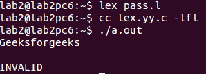
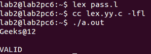

# 密码验证的 Lex 代码

> 原文:[https://www . geesforgeks . org/lex-code-for-password-validation/](https://www.geeksforgeeks.org/lex-code-for-password-validation/)

[Lex](https://www.geeksforgeeks.org/flex-fast-lexical-analyzer-generator/) 是一个生成词法分析器的计算机程序，由 Mike Lesk 和 Eric Schmidt 编写。Lex 读取指定词法分析器的输入流，并输出用 C 编程语言实现 lex 的源代码。

**问题:**我们必须验证密码。
如果密码包含以下内容，则它是正确的:

1.  至少 1 个大写字符
2.  至少 1 个小写字符
3.  至少 1 位数
4.  至少 1 个特殊字符
5.  最少 8 个字符

**示例:**

```
Input: Geeksforgeeks
Output: INVALID

Input: Geeks@12
Output: VALID 
```

**注意:**单词可以由小写字符、大写字符和数字组成。

下面是计算字数的实现。

```
%{ 
    #include<stdio.h> 
    #include<string.h> 
    int a = 0, b=0, c=0, d=0, l=0; 
%} 

%% 
[a-z]    {a++;l++;}
[A-Z]    {b++;l++;}
[0-9]    {c++;l++;}
[{content}amp;+, :;=?@#|'<>.-^*()%!] {d++;l++;}
.  ;
%% 

int yywrap(void){} 

int main() 
{    
    // The function that starts the analysis 
    yylex(); 
      if(a>0 && b>0 && c>0 && d>0 && l>=8)
    printf("VALID\n");
    else
        printf("INVALID\n");
    return 0; 
} 
```

**输出:**


