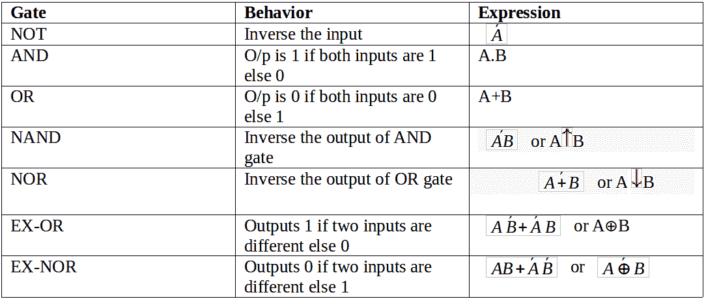
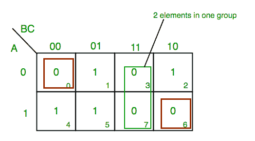
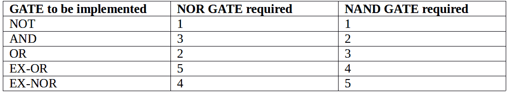
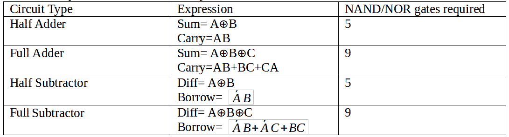
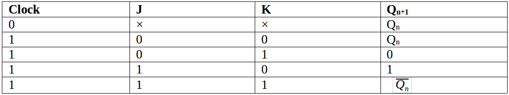
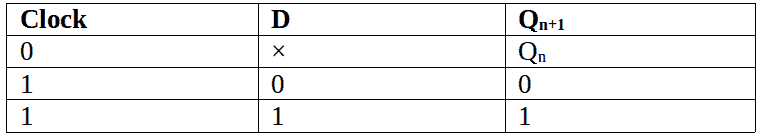
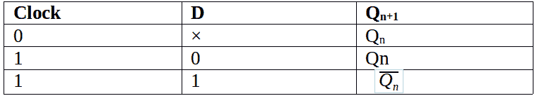

# LMN-数字电子

> 原文:[https://www.geeksforgeeks.org/lmn-digital-electronics/](https://www.geeksforgeeks.org/lmn-digital-electronics/)

参见所有科目的最后一分钟笔记[此处](https://www.geeksforgeeks.org/lmns-gq/)。
我们将以总结的形式讨论对 GATE 考试有用的重要要点。详情可参考[本](https://www.geeksforgeeks.org/gate-cs-notes-gq/)。

[**逻辑门**](https://www.geeksforgeeks.org/digital-logic-logic-gates/) :



*   **注:** 与非门和或非门被称为 UNIVERSAL GATES，因为所有其他的门都可以由它们中的任何一个构成。

**K-map 3 个变量示例:** : F(A，B，C)=π(0，3，6，7)

 从**红色**组我们找到术语

```
A    B      C’
```

取这两者的补码

```
A’     B’     C
```

现在总结它们
**(A' + B' + C)**
从**绿色**组我们找到术语

```
B         C
```

取这两个词的补语

```
B’         C’
```

现在总结它们
**(B'+C')**
从**布朗**组我们找到术语

```
A’ B’ C’
```

取这两者的补码

```
A B C
```

现在总结一下
**(A + B + C)**
我们将取这三个术语的乘积:最终表达式**(A '+B '+C)(B '+C ')(A+b+ C)**

**实现其他 gate 所需的 NAND 或 NOR 门数量**:



**组合电路:**在组合电路中，输出仅取决于当前输入；它不需要任何反馈和记忆。



[**多路复用器**](https://www.geeksforgeeks.org/multiplexers-digital-electronics/) :从多条输入线中选择一条输入线，发送到单条输出线。从输出中选择的输入线基于一组选择线。对于 2 条 <sup>n 条</sup>输入线，将有 n 条选择线和 1 条输出线。

**注:**使用 m x 1 mux 实现 n x 1 mux 所需的 mux 数量为 ceil(n-1/m-1)a⊕b.)
使用 4 x 1 mux 实现 16 x 1 mux 所需的 mux 数量为 ceil(15/3)=5。

**解复用器:**它从一条输入线中选择输入，并将其发送到多条输出线中的一条。选择的输出线基于一组选择线。对于 1 条输入线，将有 n 条选择线和 2 条 <sup>n</sup> 输出线。

**注:**使用 1×m 多路复用器实现 1×n 多路复用器所需的多路复用器数量为上限(n-1/m-1)a⊕b.)
使用 1×4 多路复用器实现 1×16 多路复用器所需的多路复用器数量为上限(15/3)=5。

[**编码器**](https://www.geeksforgeeks.org/digital-logic-encoders-decoders/) :对于 2 条 <sup>n 条</sup>输入线，有 n 条输出。它可用于将八进制或十六进制数据转换为二进制数据。

[**解码器**](https://www.geeksforgeeks.org/digital-logic-binary-decoder/) :对于 n 条输入线，它要么有 2 个 <sup>n 个</sup>输出，要么少于那个。它可以用来将二进制数据转换成其他代码，如八进制或十六进制。

**代码转换器:**代码转换器用于将一种代码转换为其他代码。

*   [**BCD 至 exclusive-3**](https://www.geeksforgeeks.org/digital-logic-code-converters-bcd8421-tofrom-excess-3/):会给二进制码加 0011(值 3)。
    **功能:**
    以 A 为 MSB 的 4 位输入(ABCD)和以 W 为 MSB 的 4 位输出(WXYZ)，O/P 为
    Z = D '
    Y = CD+C ' D '
    X = B ' D+B ' C+BC ' D '
    W = A+BC+BD
*   [**二进制到灰度转换器**](https://www.geeksforgeeks.org/digital-logic-code-converters-binary-gray-code/) **功能:**
    4 位输入(B<sub>3</sub>B<sub>2</sub>B<sub>1</sub>B<sub>0</sub>)以 B <sub>3</sub> 为 MSB，4 位输出(G <sub>3</sub> G <sub>O/P 为
    g<sub>3</sub>= b<sub>3</sub>t41】g<sub>2</sub>= b<sub>3</sub>⊕b<sub>2</sub>t48】g<sub>1</sub>= b<sub>2</sub>⊕b<sub>1</sub>t55】g<sub>0</sub>= b<sub>1</sub>⊕b</sub>
*   [**灰度到二进制转换器**](https://www.geeksforgeeks.org/digital-logic-code-converters-binary-gray-code/) **功能:**
    4 位输入(G<sub>3</sub>G<sub>2</sub>G<sub>1</sub>G<sub>0</sub>以 G <sub>3</sub> 为 MSB，4 位输出(B <sub>3</sub> B <sub>O/P 为
    b<sub>3</sub>= g<sub>3</sub>t41】b<sub>2</sub>= b<sub>3</sub>⊕g<sub>2</sub>t48】b<sub>1</sub>= b<sub>2</sub>⊕g<sub>1</sub>t55】b<sub>0</sub>= b<sub>1</sub>⊕g【t60</sub>

[**触发器**](https://www.geeksforgeeks.org/flip-flop-types-and-their-conversion/) :触发器是一种时序电路，其中 O/P 既依赖于当前输入，也依赖于先前输出。

**S-R 触发器:**

**特征方程:q<sub>n</sub>= s+r̄q<sub>n</sub>**t18】

**J-K 触发器:**

**特征方程:q<sub>n</sub>= jq̄<sub>n</sub>+r̄q<sub>n</sub>**t20】

**D 触发器:**

**特征方程:Q <sub>n+1</sub> = D**

**T 触发器:**

**特征方程:q<sub>n+1</sub>= tq̄<sub>n</sub>+t̄q<sub>n</sub>**t20】

[**计数器**](https://www.geeksforgeeks.org/counters-in-digital-logic/) 是一种存储(有时显示)特定事件或过程发生次数的设备，通常与时钟信号有关。

**专柜基本分为两种:**

**异步计数器:** 在异步计数器中我们不使用通用时钟，只有第一个触发器由主时钟驱动，其余后续计数器的时钟输入由前一个触发器的输出驱动。

**同步计数器:** 与异步计数器不同，同步计数器有一个全局时钟驱动每个触发器，因此输出并行变化。同步计数器相对于异步计数器的一个优点是，它可以在比异步计数器更高的频率上工作，因为它没有累积延迟，因为每个触发器都有相同的时钟。

**重要提示:** 计数器中使用的触发器数量始终大于等于(log <sub>2</sub> n)，其中 n =计数器中的状态数量。

本文由 Sonal Tuteja 撰写。

如果您发现任何不正确的地方，或者您想分享更多关于上面讨论的主题的信息，请写评论