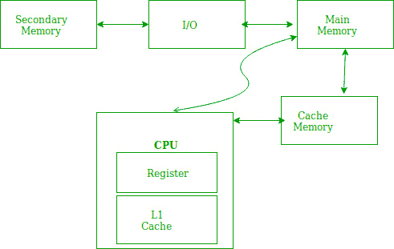
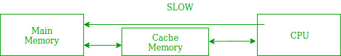
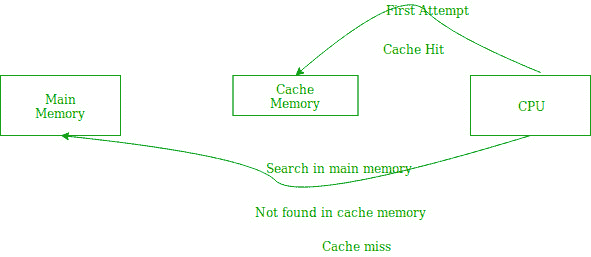
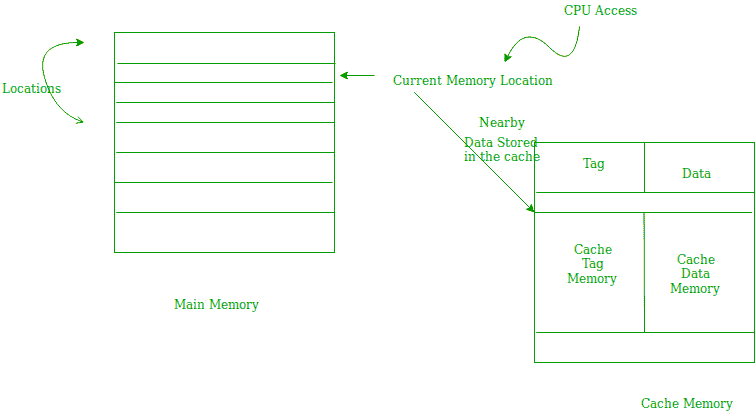

# 高速缓冲存储器中引用和高速缓存操作的位置

> 原文:[https://www . geesforgeks . org/location-of-reference-and-cache-operation-in-cache-memory/](https://www.geeksforgeeks.org/locality-of-reference-and-cache-operation-in-cache-memory/)

[引用位置](https://www.geeksforgeeks.org/computer-organization-locality-and-cache-friendly-code/)是指计算机程序倾向于在特定时间段内访问同一组存储位置的现象。换句话说，**引用位置**指的是计算机程序访问地址彼此接近的指令的趋势。引用的局部性主要通过程序中的循环和子程序调用来表现。



1.  在程序控制中出现循环的情况下，处理单元反复引用构成循环的指令集。
2.  在子程序调用的情况下，每次从内存中取出指令集。
3.  对数据项的引用也会本地化，这意味着相同的数据项会被一次又一次地引用。





在上图中，您可以看到 CPU 想要读取或提取数据或指令。首先，它将访问离它很近的高速缓冲存储器，并提供非常快速的访问。如果找到所需的数据或指令，将会提取它。这种情况称为缓存命中。但是如果在高速缓冲存储器中没有找到所需的数据或指令，那么这种情况被称为高速缓冲存储器未命中。现在，将在主存储器中搜索正在搜索的所需数据或指令，如果找到，将通过以下两种方式之一:

1.  第一种方法是，当再次需要相同的数据或指令时，中央处理器应该获取所需的数据或指令并使用它，仅此而已。CPU 再次必须为其访问相同的主存储器位置，并且我们已经知道主存储器是访问最慢的。
2.  第二种方法是将数据或指令存储在高速缓冲存储器中，以便在不久的将来再次需要时，能够以更快的方式取出。

**缓存操作:**
基于引用局部性原则。有两种方法可以从主内存中提取数据或指令，并将其存储在缓存中。这两种方式如下:

1.  **Temporal Locality –**
    Temporal locality means current data or instruction that is being fetched may be needed soon. So we should store that data or instruction in the cache memory so that we can avoid again searching in main memory for the same data.

    

    当中央处理器访问当前主存储器位置以读取所需的数据或指令时，它也存储在高速缓冲存储器中，这是基于在不久的将来可能需要相同的数据或指令的事实。这就是所谓的时间局部性。如果引用了一些数据，那么很有可能在不久的将来再次被引用。

2.  **Spatial Locality –**
    Spatial locality means instruction or data near to the current memory location that is being fetched, may be needed soon in the near future. This is slightly different from the temporal locality. Here we are talking about nearly located memory locations while in temporal locality we were talking about the actual memory location that was being fetched.

    

**缓存性能:**
缓存的性能以命中率来衡量。当中央处理器引用内存并在[缓存](https://www.geeksforgeeks.org/cache-memory/)中找到数据或指令时，称为缓存命中。如果在高速缓冲存储器中没有找到所需的数据或指令，并且 CPU 参考主存储器来找到该数据或指令，则称为高速缓存未命中。

```
Hit + Miss  = Total CPU Reference
Hit Ratio(h) = Hit / (Hit+Miss) 
```

任何内存系统的平均访问时间包括两个级别:高速缓存和主内存。如果 *Tc* 是访问高速缓冲存储器的时间，而 *Tm* 是访问主存储器的时间，那么我们可以写:

```
Tavg = Average time to access memory
Tavg = h * Tc + (1-h)*(Tm + Tc) 
```