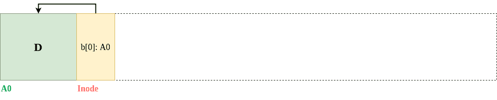
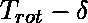
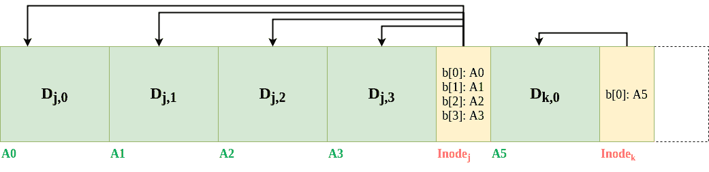
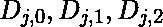
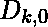

# 日志结构文件系统(LFS)

> 原文:[https://www . geesforgeks . org/log-structured-file-system-lfs/](https://www.geeksforgeeks.org/log-structured-file-system-lfs/)

Rosenblum 和 Ousterhout 在 90 年代早期引入了日志结构文件系统来解决以下问题。

*   **不断增长的系统内存:**
    随着磁盘大小的增长，可以缓存的数据量也在增加。由于读取由缓存提供服务，文件系统性能开始完全依赖于其写入性能。
*   **顺序 I/O 性能胜过随机 I/O 性能:**
    多年来，从硬盘访问位的带宽有所增加，因为同一区域可以容纳更多位。然而，小转子很难更快地移动圆盘。因此，顺序访问可以显著提高磁盘性能。
*   **现有文件系统效率低下:**
    现有文件系统执行大量写入的次数与创建新文件的次数一样多，包括索引节点、位图和数据块写入以及后续更新。产生的短寻道和旋转延迟降低了带宽。
*   **文件系统不支持 RAID:**
    此外，文件系统没有任何机制来解决 RAID-4 和 RAID-5 中的小写问题。

尽管处理器速度和主内存大小以指数级的速度增长，但磁盘访问成本的发展速度要慢得多。这就要求文件系统关注写性能，利用顺序带宽，并在磁盘写入和元数据更新时高效工作。这就是日志结构文件系统(LFS)的动机所在。

虽然不可能按顺序执行所有读取(因为任何文件都可能在任何时间点被访问)，但我们可以利用顺序写入的效率。LFS 在内存**段**中保留了一个小的缓冲区，用于所有的写操作。日志只是一种只写在开头的数据结构(可以把整个磁盘看作一个日志)。日志写满后，会以顺序方式写入磁盘的未使用部分。新数据和元数据(信息节点、目录)累积到缓冲区缓存中，并一次性写入大块(如 0.5M 或 1M 的数据段)。

以下是 LFS 实现中使用的数据结构。

*   **索引节点:**
    与 Unix 中一样，索引节点包含指向文件的物理块指针。
*   **索引节点映射:**
    此表指示磁盘上每个索引节点的位置。索引节点映射被写入段本身。
*   **段摘要:**
    这将维护有关段中每个块的信息。
*   **段使用表:**
    这告诉我们一个块上的数据量。

**顺序写入磁盘:**
考虑下图，显示了写入磁盘位置 A0 的数据块 D。与数据块一起的是索引节点，它指向数据块 d。通常，数据块为 4kb，而索引节点的大小约为 128 字节。

**高效顺序写入磁盘:**
然而，简单地顺序写入磁盘不足以实现效率。为了理解这个问题，考虑我们在时间 T 写了一个数据块 D 来寻址 A0，现在，当我们在时间 T+t 得到下一个要写入 A0+1 的数据块时，磁盘已经旋转了一些单位。如果磁盘的旋转时间是，我们必须在写入第二个块之前等待，以便两个地址(A0，A0+1)是连续的。

这个问题的解决方案很简单——我们可以简单地将一些连续的写入分组并临时存储在一个段中，然后将它们一起写入磁盘，而不是在每两次连续的数据块写入后等待。因此，我们不是在每个数据块之后等待磁盘重新定位，而是在每个 x 个数据块之后等待它重新定位，其中 x 是段的容量。下图说明了这个概念。

和是对同一文件 j 的 4 次更新，一次写入磁盘。这是缓冲到 LFS 的一组更新之一。是文件 k 的更新，在下一次循环中写入磁盘。

**进程简单来说:**
在找到文件的索引节点(保存在索引节点映射中)后，LFS 读取进程与 Unix 文件系统中的相同。写过程可以总结如下:

*   每次写入都会将新块添加到内存中的当前段缓冲区。
*   当该段已满时，它将被写入磁盘。

LFS 还消除了前面提到的 RAID-4 和 RAID-5 中的小写入问题，因为写入的是整个数据段，而不是小数据块。

**挑战:**
突然出现的一个问题是，随着旧文件块被新文件块替换，日志中的数据段往往会变得碎片化。由于 LFS 生产分散在磁盘上不同数据段的旧数据拷贝，因此需要定期清除这些拷贝。为此，一个更干净的过程“清洗”旧的片段。这个清理器获取多个非完整段并压缩它们，创建一个完整段，从而释放空间。