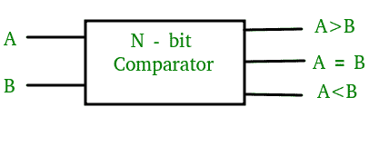
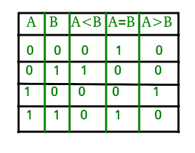
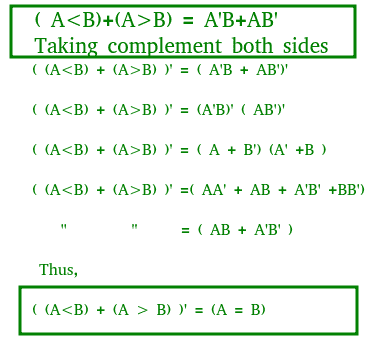
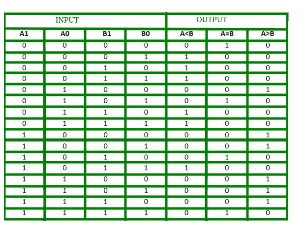
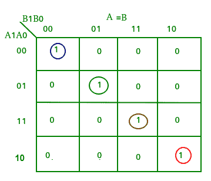
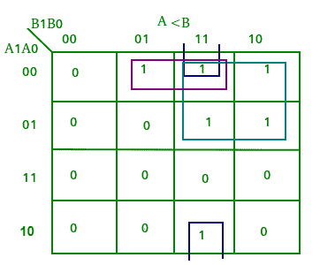
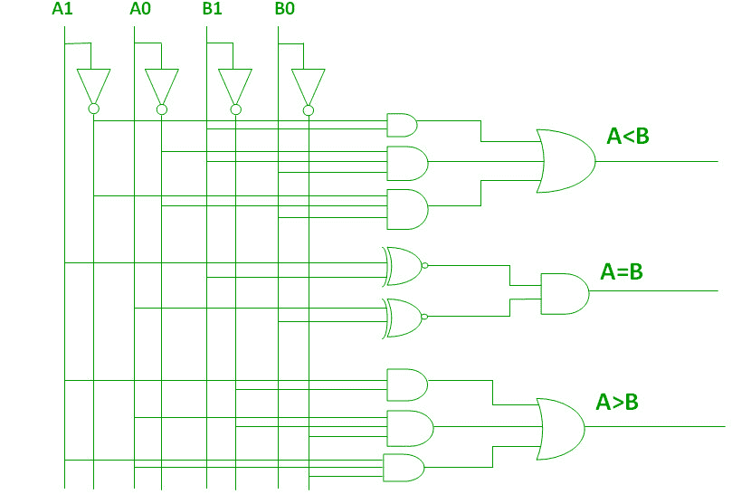
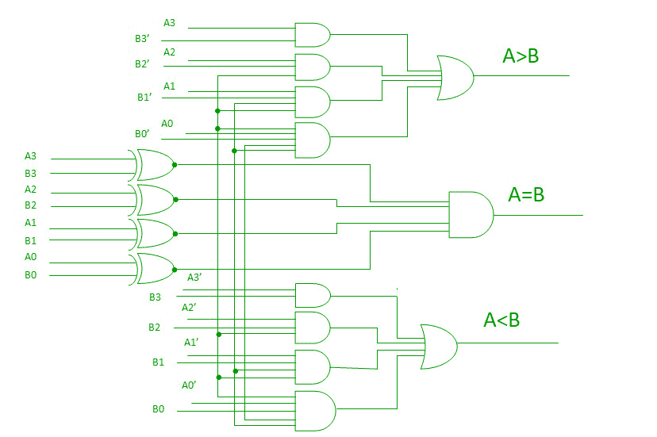
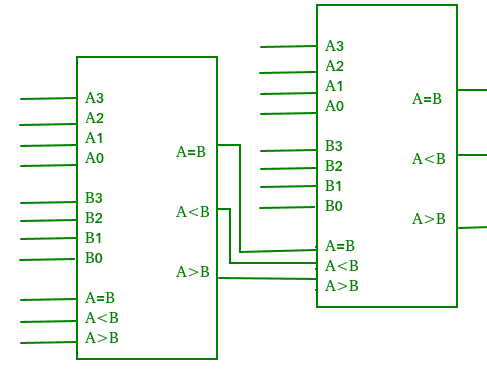

# 数字逻辑中的幅度比较器

> 原文:[https://www . geesforgeks . org/量值-数字逻辑比较器/](https://www.geeksforgeeks.org/magnitude-comparator-in-digital-logic/)

量值数字比较器是一种组合电路，**比较两个数字或二进制数**，以找出一个二进制数是否等于、小于或大于另一个二进制数。我们在逻辑上设计了一个电路，它有两个输入端，一个用于 A，另一个用于 B，并且有三个输出端，一个用于 A > B 条件，一个用于 A = B 条件，一个用于 A < B 条件。



### 1 位幅度比较器–

用于比较两位的比较器称为单位比较器。它由两个输入端和三个输出端组成，每个输入端对应两个单比特数，输出端在两个二进制数之间产生小于、等于和大于。

1 位比较器的真值表如下:



从上面的真值表中，每个输出的逻辑表达式可以表示如下:

```
A>B: AB'
A<B: A'B
A=B: A'B' + AB
```

从以上表达式中，我们可以推导出以下公式:



通过使用这些布尔表达式，我们可以为这个比较器实现一个逻辑电路，如下所示:


逻辑图错了

### 2 位幅度比较器–

用于比较两个二进制数的比较器称为 2 位幅度比较器。它由四个输入和三个输出组成，用于生成两个二进制数之间的小于、等于和大于。

2 位比较器的真值表如下:



从上面的真值表中，每个输出的 K 图可以绘制如下:






从上面的 K 图中，每个输出的逻辑表达式可以表示如下:

```
A>B:A1B1’ + A0B1’B0’ + A1A0B0’
A=B: A1’A0’B1’B0’ + A1’A0B1’B0 + A1A0B1B0 + A1A0’B1B0’
   : A1’B1’ (A0’B0’ + A0B0) + A1B1 (A0B0 + A0’B0’)
   : (A0B0 + A0’B0’) (A1B1 + A1’B1’)
   : (A0 Ex-Nor B0) (A1 Ex-Nor B1)
A<B:A1’B1 + A0’B1B0 + A1’A0’B0
```

通过使用这些布尔表达式，我们可以为这个比较器实现一个逻辑电路，如下所示:



### 4 位幅度比较器–

用于比较四位中每一位的两个二进制数的比较器称为 4 位幅度比较器。它由八个输入和三个输出组成，每个输入对应两个四位数，三个输出用于生成两个二进制数之间的小于、等于和大于。

在 4 位比较器中，A>B 的条件在以下四种情况下是可能的:

1.  如果 A3 = 1 且 B3 = 0
2.  如果 A3 = B3，A2 = 1，B2 = 0
3.  如果 A3 = B3，A2 = B2，A1 = 1，B1 = 0
4.  如果 A3 = B3，A2 = B2，A1 = B1 和 A0 = 1 和 B0 = 0

类似于 A **的条件**

1.  **如果 A3 = 0 且 B3 = 1**
2.  **如果 A3 = B3，A2 = 0，B2 = 1**
3.  **如果 A3 = B3，A2 = B2，A1 = 0，B1 = 1**
4.  **如果 A3 = B3，A2 = B2，A1 = B1 和 A0 = 0 和 B0 = 1**

**只有当一个数的所有单个位与另一个数的相应位完全一致时，A=B 的条件才是可能的。**

**从上面的陈述中，每个输出的逻辑表达式可以表达如下:**

**AA，831331 r:(A3 EioNor 33)A 2132 ' A(A3 Ex-Nor 133)(A2 Ex-Nor 132)A 131 ' A(A3 Ex-Nor 33)(A2 enor 132)(Al Ex-Nor 31)A 01301
，13:A3 ' 03 A(A3 Ex-Nor 33)A211:12 A(A3 Ex-Nor 83)(A2 Ex-Nor 132)Ar131 A(A3 Ex-Nor 33)(A**

**通过使用这些布尔表达式，我们可以为这个比较器实现一个逻辑电路，如下所示:**

****

### **级联比较器–**

**通过级联两个或更多个 4 位比较器对四位以上执行比较操作的比较器称为级联比较器。当两个比较器级联时，低阶比较器的输出连接到高阶比较器的相应输入。**

****

### **比较器的应用–**

1.  **比较器用于中央处理器和微控制器。**
2.  **这些用于控制应用，其中二进制数代表物理变量，如温度、位置等。与参考值进行比较。**
3.  **比较器也用作过程控制器和伺服电机控制。**
4.  **用于密码验证和生物识别应用。**

****参考资料–**
[数字比较器–维基百科](https://en.wikipedia.org/wiki/Digital_comparator)
[比较器–epgp . inflibnet](http://epgp.inflibnet.ac.in/epgpdata/uploads/epgp_content/S000574EE/P001494/M015069/ET/1459849153et09.pdf)**