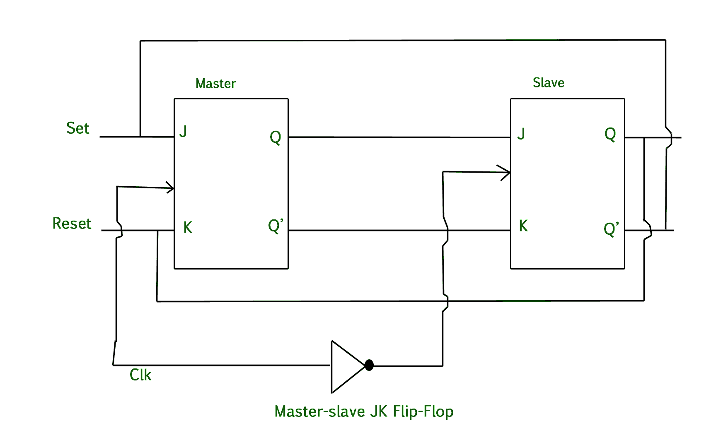
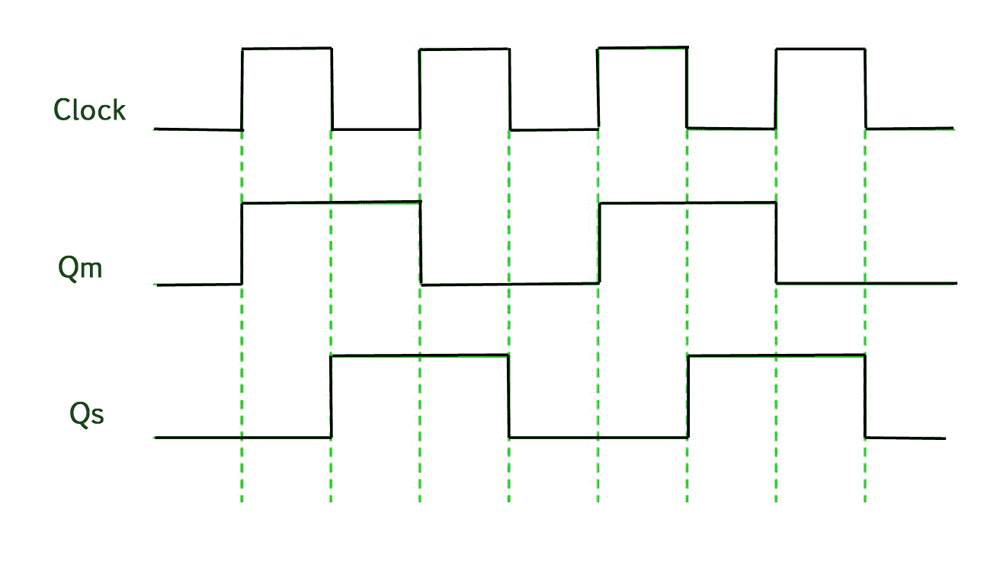

# 主从 JK 触发器

> 原文:[https://www.geeksforgeeks.org/master-slave-jk-flip-flop/](https://www.geeksforgeeks.org/master-slave-jk-flip-flop/)

**先决条件–**[触发器类型及其转换](https://www.geeksforgeeks.org/flip-flop-types-and-their-conversion/)

**JK 触发器中的争用条件–**对于 J-K 触发器，如果 J=K=1，并且如果 clk=1 持续很长一段时间，那么只要 clk 为高电平，Q 输出就会跳变，这使得触发器的输出不稳定或不确定。这个问题在 J-K 触发器中被称为绕圈条件。通过确保时钟输入仅在很短的时间内处于逻辑“1”，可以避免这个问题(争用条件)。这就引入了**主从 JK** 触发器的概念。

**主从 JK 触发器–**
主从触发器基本上是两个 JK 触发器串联在一起的组合。其中一个作为**“主人”**，另一个作为**“奴隶”**。主触发器的输出连接到从触发器的两个输入，从触发器的输出反馈到主触发器的输入。

除了这两个触发器，电路还包括一个**反相器**。反相器连接到时钟脉冲，使得反相的时钟脉冲被提供给从触发器。换句话说，如果主触发器的 CP=0，那么从触发器的 CP=1，如果主触发器的 CP=1，那么从触发器的 CP = 0。

**主从触发器的工作–**

1.  当时钟脉冲变为 1 时，从机被隔离；j 和 K 输入可能会影响系统的状态。从触发器被隔离，直到 CP 变为 0。当 CP 回到 0 时，信息从主触发器传递到从触发器，并获得输出。
2.  首先，主触发器是正电平触发的，从触发器是负电平触发的，因此主触发器在从触发器之前做出响应。
3.  如果 J=0，K=1，主机的高 Q’输出到从机的 K 输入，时钟迫使从机复位，因此从机复制主机。
4.  如果 J=1，K=0，则主机的高 Q 输出转到从机的 J 输入，时钟的负转换设置从机，复制主机。
5.  如果 J=1 和 K=1，它会触发时钟的正转换，因此从机会触发时钟的负转换。
6.  如果 J=0，K=0，触发器被禁用，Q 保持不变。

**主触发器的时序图–**

1.  当时钟脉冲为高电平时，主机的输出为高电平，并保持高电平，直到时钟为低电平，因为状态已存储。
2.  现在，当时钟脉冲再次变为高电平时，主机的输出变为低电平，并保持低电平，直到时钟再次变为高电平。
3.  因此，切换发生在一个时钟周期内。
4.  当时钟脉冲为高电平时，主机工作，但从机不工作，因此从机的输出保持低电平，直到时钟保持高电平。
5.  当时钟为低电平时，从机开始工作并保持高电平，直到时钟再次变为低电平。
6.  切换发生在整个过程中，因为输出在一个周期内改变一次。

这使得主从 J-K 触发器成为同步器件，因为它只通过时钟信号的时序传递数据。