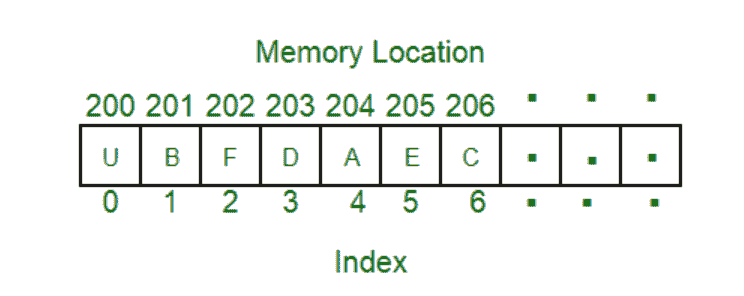

# 内存访问方法

> 原文:[https://www.geeksforgeeks.org/memory-access-methods/](https://www.geeksforgeeks.org/memory-access-methods/)

这是 4 种内存访问方法:

**1。顺序访问:-**
在这种方法中，以特定的线性顺序方式访问内存，就像在[单链表](https://www.geeksforgeeks.org/data-structures/linked-list/singly-linked-list/)中访问一样。访问时间取决于数据的位置。

这种顺序存储器存取的应用是磁带、磁盘和光存储器。

**2。随机存取:-**
在这个方法中，可以像在[数组](https://www.geeksforgeeks.org/array-data-structure/)中存取一样，随机存取内存的任何位置。在这种访问方法中，物理位置是独立的。

这种随机存取存储器的应用是随机存取存储器和只读存储器。

**3。直接访问:-**
在这种方法中，单个块或记录根据物理位置具有唯一的地址。访问是通过直接访问以到达大致的邻近区域，加上顺序搜索、计数或等待到达最终目的地来完成的。该方法是上述两种访问方法的组合。访问时间取决于[存储技术](https://www.geeksforgeeks.org/storage-management/)的内存组织和特性。访问是半随机或直接的。

因此直接存储器存取的应用是[磁硬盘](https://www.geeksforgeeks.org/differences-between-magnetic-tape-and-magnetic-disk/)，读/写头。

**4。关联访问:-**
在这个内存中，访问的是一个字，而不是它的地址。这种接入方式是一种特殊类型的随机接入方式。

因此直接存储器存取的应用是[高速缓冲存储器](https://www.geeksforgeeks.org/cache-memory-in-computer-organization/)。