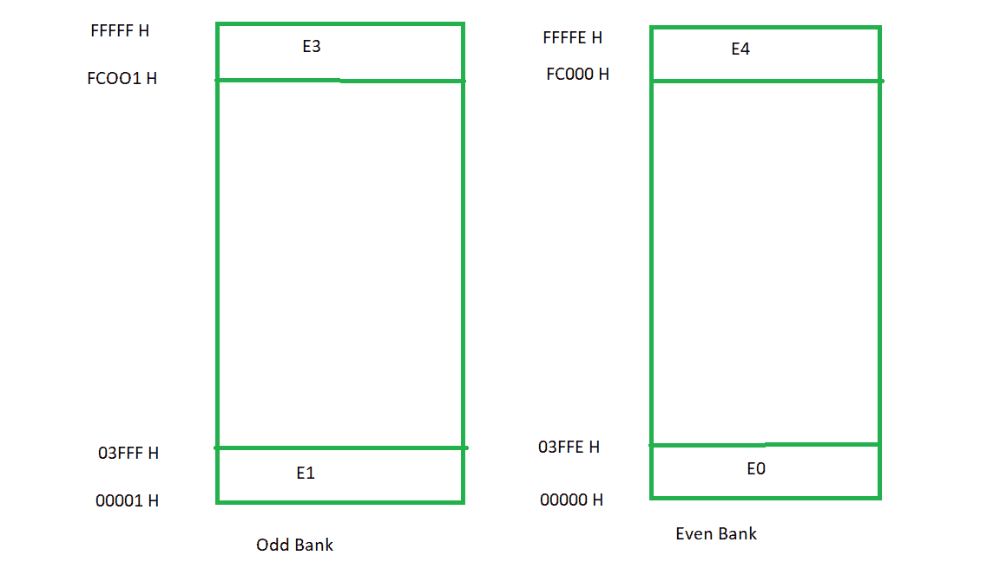

# 微处理器中的内存银行

> 原文:[https://www . geesforgeks . org/memory-banking-in-microprocessor/](https://www.geeksforgeeks.org/memory-banking-in-microprocessor/)

8086 处理器提供 16 位数据总线。因此，它能够在一个周期内传输 16 位，但每个存储单元只有一个字节(8 位)，因此，我们需要两个周期来从两个不同的存储单元访问 16 位(每个 8 位)。这个问题的解决方案是内存银行。通过内存银行，我们的目标是在一个周期内访问两个连续的内存位置(传输 16 位)。

存储芯片平均分为两部分(存储体)。其中一个存储体包含名为**偶数存储体**的偶数地址，另一个包含名为**奇数存储体**的奇数地址。偶数存储体总是给出较低的字节，因此偶数存储体也称为**较低存储体** (LB)，奇数存储体也称为**较高存储体** (HB)。

这种存储方案允许从两个存储体同时访问两个对齐的存储位置，并处理 16 位数据传输。内存银行并没有强制要求传输 16 位，它促进了 16 位数据的传输。
8 位和 16 位传输之间的选择取决于程序员给出的指令。

**示例:**

地址的最低有效位(A 0 不用于字节选择)被保留用于存储体选择。因此 A 0 =0 将选择偶数银行。 BHE 信号用于选择奇数存储体，处理器将使用这两个信号的组合来决定数据传输的类型。

| BHE | A 0 | 转让类型 |
| Zero | Zero | 从 HB 和 LB 传输 16 位数据 |
| Zero | one | 从 HB 传输 8 位数据 |
| one | Zero | 从 LB 传输 8 位数据 |
| one | one | 无(空闲) |

在这种情况下，第一个机器周期生成奇数地址(A 0 =1)在高阶数据总线上传输低阶 8 数据位。在第二个机器周期中，高阶数据总线将在低阶数据总线上传输。