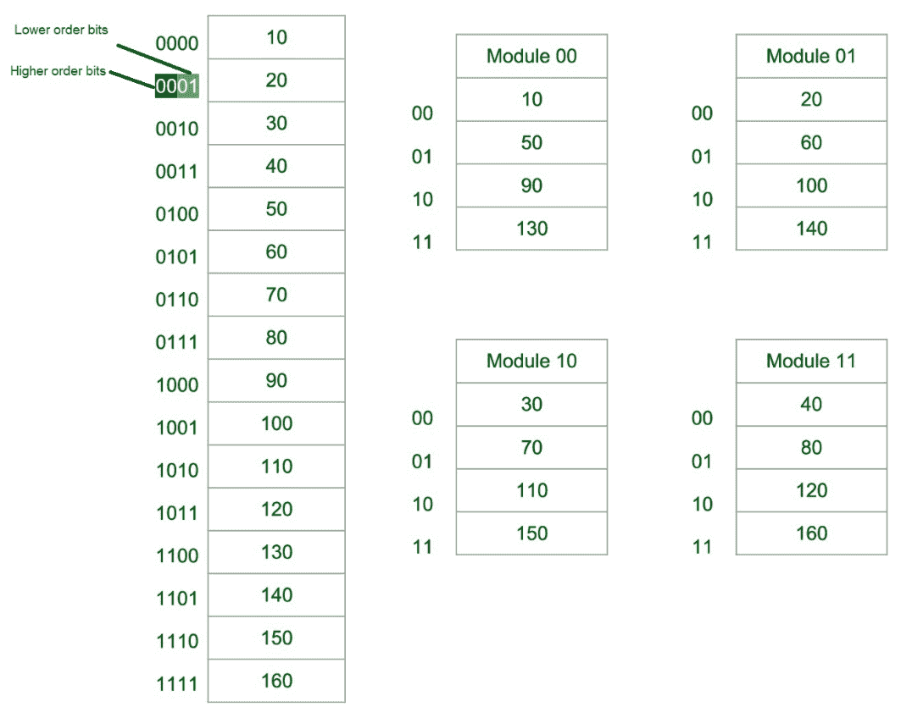

# 内存交错

> 原文:[https://www.geeksforgeeks.org/memory-interleaving/](https://www.geeksforgeeks.org/memory-interleaving/)

先决条件–[虚拟内存](https://www.geeksforgeeks.org/virtual-memory-operating-systems/)
抽象是计算最重要的方面之一。这是在计算领域广泛实施的实践。

**内存交错**或多或少是一种抽象技术。虽然它与抽象有点不同。这是一种将内存分成多个模块的技术，这样地址空间中的连续字就被放在不同的模块中。

**模块中的连续单词:**


**图-1:** 模块中的连续单词

让我们假设将 16 个数据传输到四个模块。其中模块 00 是模块 1，模块 01 是模块 2，模块 10 是模块 3，模块 11 是模块 4。另外，10，20，30…130 是要传输的数据。

从模块 1 的上图中，10[数据]被传输，然后是 20、30 &最后是 40，它们是数据。这意味着数据在模块中连续添加，直到达到最大容量。

最高有效位(MSB)提供模块的地址&最低有效位(LSB)提供模块中数据的地址。

对于**例**，要得到 90(数据)1000 将由处理器提供。这个 10 表示数据在模块 10(模块 3)中& 00 是模块 10(模块 3)中 90 的地址。所以，

```
Module 1 Contains Data : 10, 20, 30, 40
Module 2 Contains Data : 50, 60, 70, 80
Module 3 Contains Data : 90, 100, 110, 120
Module 4 Contains Data : 130, 140, 150, 160 
```

**连续模块中的连续词:**



**图-2:** 连续模块中的连续词

现在，我们再次假设将 16 个数据传输到四模块。但是现在连续数据被添加到连续模块中。即模块 1 增加 10[数据]，模块 2 增加 20[数据]等等。

最低有效位提供模块的地址，最高有效位提供模块中数据的地址。

对于**例**，要得到 90(数据)1000 将由处理器提供。00 表示数据在模块 00(模块 1)中& 10 是模块 00(模块 1)中 90 的地址。也就是

```
Module 1 Contains Data : 10, 50, 90, 130
Module 2 Contains Data : 20, 60, 100, 140
Module 3 Contains Data : 30, 70, 110, 150
Module 4 Contains Data : 40, 80, 120, 160 
```

**我们为什么要使用内存交错？[优势]:**
每当处理器从主存储器请求数据时。数据块(区块)先传输到缓存，然后传输到处理器。因此，每当发生缓存未命中时，数据都将从主内存中取出。但是主存相对比缓存慢。所以为了提高主存的存取时间，采用了交错存取。

我们可以同时访问所有四个模块，从而实现并行。从图 2 中，可以使用高位从模块中获取数据。这种方法有效地利用了内存。