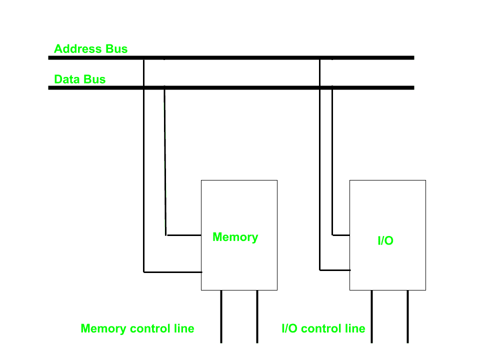
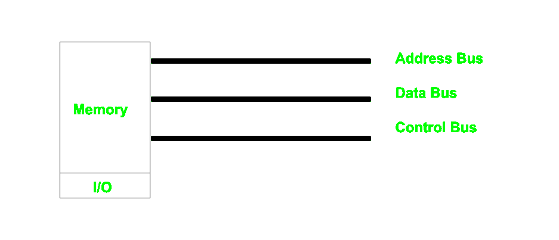

# 内存映射输入输出和隔离输入输出

> 原文:[https://www . geesforgeks . org/memory-mapped-I-o-and-isolated-I-o/](https://www.geeksforgeeks.org/memory-mapped-i-o-and-isolated-i-o/)

由于中央处理器需要与各种存储器和输入输出设备(I/O)通信，我们知道处理器和这些设备之间的数据在系统总线的帮助下流动。系统总线有三种分配方式:

1.  独立的一组地址、控制和数据总线到输入/输出和存储器。
2.  具有用于输入/输出和存储器的公共总线(数据和地址)，但具有单独的控制线。
3.  具有用于输入/输出和存储器的公共总线(数据、地址和控制)。

第一种情况很简单，因为两者都有不同的地址空间和指令集，但需要更多的总线。

#### 隔离输入/输出–

然后我们有隔离的输入/输出，其中输入/输出和存储器有公共总线(数据和地址)，但输入/输出有单独的读写控制线。因此，当中央处理器解码指令时，如果数据用于输入/输出，则它将地址放在地址线上，并将输入/输出读或写控制线设置为开，因为数据传输发生在中央处理器和输入/输出之间。由于存储器和输入/输出的地址空间是隔离的，因此名称也是如此。这里输入输出的地址叫做端口。这里我们对输入输出和内存都有不同的读写指令。

#### 内存映射输入/输出–

在这种情况下，每条总线都是公共的，因此同一组指令为内存和输入/输出工作。因此，我们操纵的输入/输出与内存相同，并且两者都具有相同的地址空间，因此内存的寻址能力变小，因为有些部分被输入/输出占用

**内存映射输入/输出和隔离输入/输出的区别–**

| 隔离输入输出 | 内存映射输入/输出 |
| --- | --- |
| 内存和输入/输出有独立的地址空间 | 两者具有相同的地址空间 |
| 存储器可以使用所有地址 | 由于增加了输入/输出可寻址存储器，存储器变得更少 |
| 独立的指令控制输入输出和内存中的读写操作 | 相同的指令可以控制输入输出和内存 |
| 在这个输入/输出地址中称为端口。 | 正常存储器地址用于两者 |
| 由于有单独的总线，效率更高 | 效率较低 |
| 由于更多总线，尺寸更大 | 尺寸较小 |
| 它很复杂，因为单独的逻辑用于控制两者。 | 使用更简单的逻辑，因为输入/输出也只被视为内存。 |