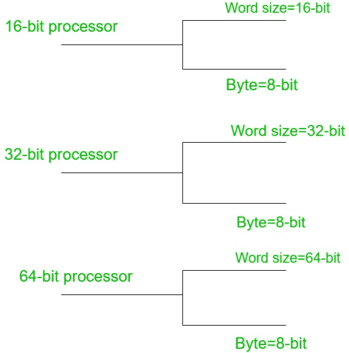

# 计算机体系结构中的内存组织

> 原文:[https://www . geesforgeks . org/memory-organization-in-computer-architecture/](https://www.geeksforgeeks.org/memory-organisation-in-computer-architecture/)

内存是以单元的形式组织的，每个单元都可以用一个叫做地址的唯一数字来标识。每个单元能够识别控制信号，如“读”和“写”，当它想读或写地址时，由中央处理器产生。每当中央处理器执行程序时，都需要将指令从内存传输到中央处理器，因为程序在内存中可用。为了访问指令，中央处理器生成内存请求。

**内存请求:**
内存请求包含地址和控制信号。例如，当将数据插入堆栈时，每个块消耗内存( [RAM](https://www.geeksforgeeks.org/different-types-ram-random-access-memory/) ),存储单元的数量可以由存储芯片的容量决定。

**例:**求 64k*8 内存芯片中的单元总数。

```
Size of each cell = 8
Number of bytes in 64k = (2^6)*(2^10)

Therefore, 
the total number of cells = 2^16 cells 
```

通过单元的数量，可以确定启用一个单元所需的地址线的数量。

**字长:**
是一个 CPU 一次可以处理的最大位数，它取决于处理器。字大小是由指令集或处理器硬件作为一个单元处理的固定大小的数据。



由于代和当前技术的原因，字的大小因处理器架构而异，它可能低至 4 位，也可能高至 64 位，这取决于特定处理器能够处理的内容。字长用于许多概念，如地址、寄存器、定点数、[浮点数](https://www.geeksforgeeks.org/floating-point-representation-basics/)。