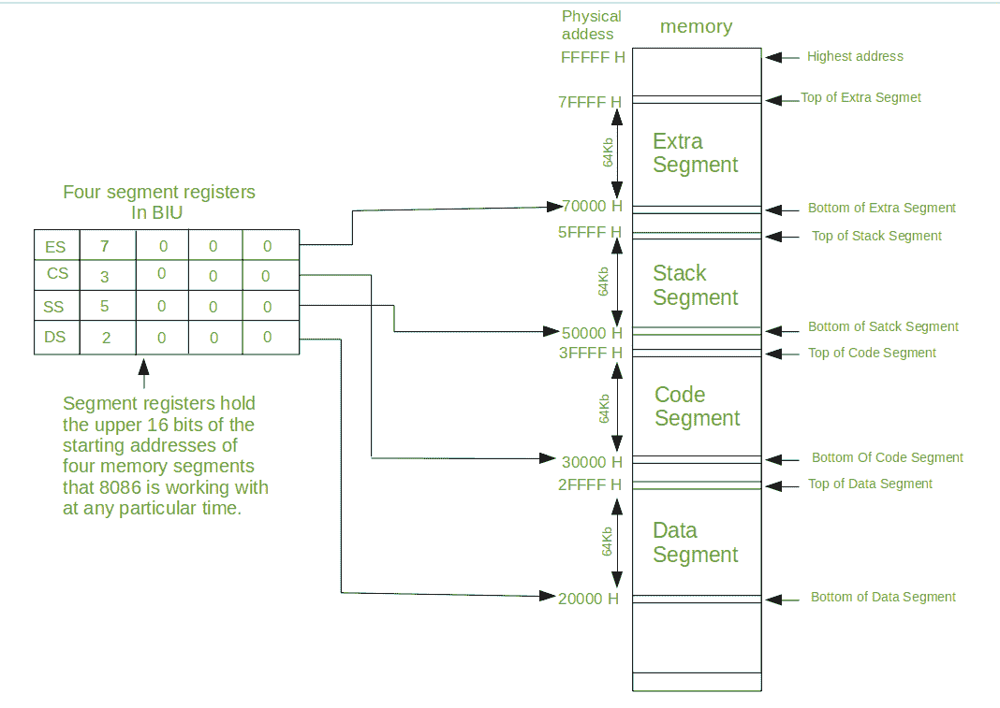
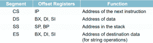

# 8086 微处理器中的内存分段

> 原文:[https://www . geesforgeks . org/memory-segmentation-8086-微处理器/](https://www.geeksforgeeks.org/memory-segmentation-8086-microprocessor/)

先决条件–[分段](https://www.geeksforgeeks.org/operating-systems-segmentation/)
**分段**是将计算机的主存在逻辑上划分为不同的段，每个段都有自己的基址的过程。它基本上是用来提高计算机系统的执行速度，使处理器能够方便快捷地从内存中获取和执行数据。

**分段需求–**
总线接口单元(BIU)包含四个 16 位专用寄存器(如下所述)，称为分段寄存器。

*   **代码段寄存器(CS):** 用于寻址内存代码段中存储可执行程序的内存位置。
*   **数据段寄存器(DS):** 指向存储数据的存储器的数据段。
*   **额外段寄存器(ES):** 也指存储器中的一个段，它是存储器中的另一个数据段。
*   **栈段寄存器(SS):** 用于寻址内存的栈段。堆栈段是用于存储堆栈数据的内存段。

8086 中的地址线数量是 20，8086 BIU 将发送 20 位地址，以便访问 1MB 存储位置之一。四个段寄存器实际上包含 64 KB 的四个内存段的起始地址的高 16 位，8086 在该时刻使用每个内存段。段是内存的一个逻辑单元，最长可达 64 千字节。每个段由连续的存储单元组成。它是一个独立的、可单独寻址的单元。起始地址将一直变化。它不会被修复。

请注意，8086 在任何给定时间都不能处理整个 1MB 内存。但是，它只能在整个 1MB 内存中的四个 64KB 段上工作。

下面是在 8086 的 1M 字节内存空间中定位四个 64 千字节段的一种方法。

**分段类型–**

1.  **重叠段–**段从特定地址开始，其最大大小可达 64k 字节。但是如果另一个片段从第一个片段的这个 64k 字节位置开始，那么这两个片段被称为*重叠片段*。
2.  **非重叠段–**段从特定地址开始，其最大大小可达 64k 字节。但是如果另一个段在第一个段的这个 64k 字节位置之前开始，那么这两个段被称为*非重叠段*。

**分割规则**分割过程遵循以下一些规则:

*   一个段的起始地址应该能被 16 等分。
*   Minimum size of a segment can be 16 bytes and the maximum can be 64 kB.

    

    **分割的优势**分割的主要优势如下:

    *   它提供了强大的内存管理机制。
    *   数据相关或堆栈相关操作可以在不同的段中执行。
    *   代码相关操作可以在单独的代码段中完成。
    *   它允许进程轻松共享数据。
    *   它允许扩展处理器的寻址能力，即分段允许使用 16 位寄存器来给出 1 兆字节的寻址能力。如果没有分段，则需要 20 位寄存器。
    *   通过为每个区域分配多个段，可以将代码数据或堆栈段的内存大小提高到 64 KB 以上。