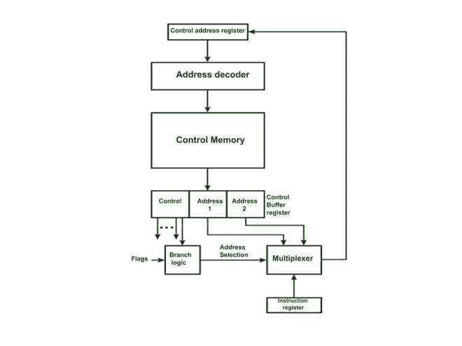
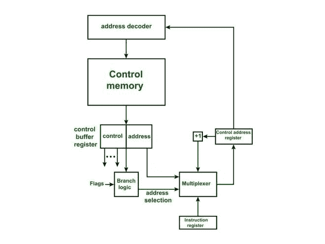
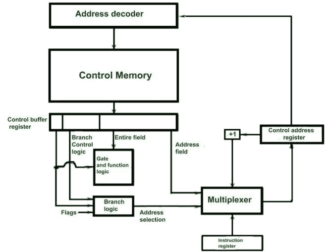

# 微指令排序

> 原文:[https://www.geeksforgeeks.org/micro-instruction-sequencing/](https://www.geeksforgeeks.org/micro-instruction-sequencing/)

**设计微指令排序技术的需要:**
第一个目的是最小化控制存储器的大小，因为控制存储器存在于处理器内部。
第二个目的是尽可能快地执行微指令。这意味着下一条微指令的地址可以尽快计算出来。

负责减小控制存储器大小的因素有–

*   并行度，即可以同时执行多少个微操作。
*   控制信息的表示/编码。
*   指定下一条微指令地址的方法。

在处理器中执行的微操作的数量取决于处理器的体系结构，指令的编码使它变得更短。但是最主要的问题是计算下一条微指令的地址。

下一条微指令的地址可以是–

*   序列中下一个微指令的地址，即一个接一个。
*   分支地址(可以是有条件的或无条件的)。
*   基于指令的操作码计算。

第一条微指令的地址可以根据指令寄存器中的指令操作码计算一次，然后将该地址载入 CMAR(控制存储器地址寄存器)。CMAR 把地址传给了解码器。解码器从控制存储器中识别相应的微指令。
一条微指令有两个字段:控制字段和地址字段。

*   **控制字段–**
    确定要生成哪些控制信号。
*   **地址字段–**
    确定下一条微指令的地址。
*   该地址被进一步加载到 CMAR 以获取下一条微指令。

众所周知，微指令通常长时间不按顺序执行。假设在 4 或 5 个微指令之后，分支通常会发生。因此，我们的主要动机是使分支算法更好，以便能够有效地计算下一条微指令的地址。
因此，微指令排序是确定微程序流程的方法。

因此，有些技术是基于用于排序的地址数量–

1.  每个微指令中的两个地址字段(双地址字段)。
2.  单一地址字段(单一地址字段)。
3.  可变格式微指令

**1。双地址字段–**

**双地址字段**

。

*   在这种方法中，微指令不是以顺序方式执行的。
*   指令寄存器给出第一条微指令的地址。
*   此后，每条微指令给出下一条微指令的地址。
*   如果是条件微指令，它将包含两个地址字段。
*   一个条件为真，另一个为假。因此，它被称为双地址字段。
*   多路复用器将根据状态标志决定载入控制存储器地址寄存器(CMAR)的地址。

这里，大量的控制存储器被浪费，因为在许多微指令中(即，对于顺序的或无条件的)至少一个地址字段不是必需的。

**2。单地址字段–**
经过一些修改和添加的逻辑，地址数量减少到一个。这里，使用了一个名为微程序计数器的新寄存器。在这种情况下，下一个微指令地址可以是下一个顺序地址的地址，或者可以是使用操作码生成的地址，或者可以是存储在微指令的地址字段中的地址。

**单地址字段。**

*   在这种方法中，微指令以顺序方式执行。
*   指令寄存器给出了进入 CMAR 的第一条微指令的地址。
*   此后，地址简单地递增。
*   因此，每个微指令不需要携带下一个微指令的地址。
*   只要微程序以顺序的方式执行，这是正确的。
*   对于无条件分支，微指令包括分支地址。这个地址将被载入 CMAR。
*   对于条件分支，微指令包含真实条件的分支地址。如果条件为假，CMAR 的当前地址将简单地递增。
*   这意味着即使在最坏的情况下，微指令也只能携带一个地址。
*   因此，它被称为单地址字段。
*   多路复用器将根据状态标志决定载入控制存储器地址寄存器(CMAR)的地址。

这种方法是常用的。但是，如果指令是按顺序执行的，那么每个微指令在单个地址字段中提供的空间就不太有用了。

**3。可变地址格式–**

*   在这种技术中，使用了两种格式。在这种技术中，微指令中需要一位来区分控制微指令或分支微指令。第一种格式提供控制微指令(即比特用于产生控制信号)，而第二种格式提供分支逻辑和地址(可以有条件或无条件分支)。
*   在第一种格式中，微指令包含控制信号，然后通过使用指令寄存器的操作码计算下一个微指令地址，或者它是序列中下一个微指令的地址。在这种方法中，分支微指令需要一个额外的周期。

**可变指令格式**