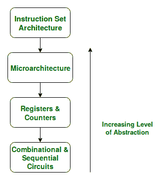

# 微体系结构和指令集体系结构

> 原文:[https://www . geeksforgeeks . org/微体系结构和指令集体系结构/](https://www.geeksforgeeks.org/microarchitecture-and-instruction-set-architecture/)

在本文中，我们将了解什么是*指令集架构(ISA)* ，以及**‘ISA’**和*微架构*之间的区别。从*程序员的角度来看*，ISA 被定义为计算机的设计。

这基本上意味着一个 **ISA** 描述了一个计算机的**设计，它必须支持**基本操作**。ISA 不关心计算机的具体实现细节。它只关心计算机必须支持的一组或一组基本操作。例如，AMD Athlon 和酷睿 2 双核处理器的实现方式完全不同，但它们或多或少支持 x86 指令集中定义的同一组基本操作。**

让我们以 **MIPS ISA** 为例，尝试理解 ISA 的目标。由于其简单性，MIPS 是教育领域应用最广泛的国际审计准则之一。

1.  ISA 定义了处理器支持的指令类型。
    根据它们执行的操作类型，MIPS 指令分为 3 种类型:
    *   **算术/逻辑指令:**
        这些指令对一个或多个操作数执行各种算术&逻辑运算。
    *   **数据传输指令:**
        这些指令负责将指令从内存传输到处理器寄存器，反之亦然。
    *   **分支和跳转指令:**
        这些指令负责断开指令的顺序流，跳转到其他各个位置的指令，这是实现*功能*和*条件语句*所必需的。

2.  The ISA defines the **maximum length** of each type of instruction. 

    由于 MIPS 是一个 32 位的 is a，每条指令必须容纳在 32 位之内。

3.  ISA 定义了每种指令的**指令格式**。
    指令格式决定了整个指令如何在 32 位内编码
    在 MIPS ISA 中有 3 种类型的指令格式:
    *   指令格式
    *   指令格式
    *   指令格式

如果我们看看抽象层次:

**图–**抽象层次

我们注意到**微体系结构**级别刚好位于 **ISA** 级别之下，因此与由 **ISA** 定义的计算机支持的基本操作的实现有关。因此，我们可以说 AMD Athlon 和酷睿 2 双核处理器基于相同的 ISA，但具有不同的微架构，具有不同的性能和效率。

现在有人可能会问，需要区分**微体系结构**和 **ISA** 吗？

这个问题的答案在于，需要基于相同的 **ISA** 来标准化和维护不同硬件实现之间的程序兼容性。使不同的机器兼容同一组基本指令(ISA)允许相同的程序在许多不同的机器上平稳运行，从而使程序员更容易同时有效地记录和维护许多不同机器的代码。

这种灵活性是我们首先定义一个 ISA，然后设计不同的微体系结构来实现机器的原因。ISA 的设计是计算机体系结构研究的主要任务之一。

<figure class="table">

| 指令集体系结构 | 微体系结构 |
| --- | --- |
| ISA 负责定义处理器支持的指令集。例如，下面给出了 ARMv7 ISA 定义的一些指令。 | 微体系结构更关心如何执行指令的低级实现，并处理指令流水线、分支预测、无序执行等概念。 |
| **计算机体系结构的分支**更倾向于指令集体系结构的分析与设计。比如英特尔开发了 *x86* 架构，ARM 开发了 *ARM* 架构，& AMD 开发了 *amd64* 架构。加州大学伯克利分校开发的 RISC-V ISA 是开源 ISA 的一个例子。 | 另一方面，**计算机组织**的分支涉及特定 ISA 的实现，处理各种硬件实现技术，即微体系结构级别。例如，ARM 授权高通、苹果等其他公司使用 ARM ISA，但这些公司都有自己的这种 ISA 实现，从而使它们在性能和能效方面有所不同。高通开发的 *Krait* 内核有不同的微架构，苹果 A 系列处理器也有不同的微架构。 |

*x86* 由英特尔开发，但我们看到几乎每年英特尔都会推出新一代 I 系列处理器。大多数英特尔处理器所基于的 *x86* 架构在这几代中基本保持不变，但它们的不同之处在于底层微架构。它们在实现上有所不同，因此被称为具有改进的性能。这些由英特尔开发的各种微体系结构被代号为‘Nehalem’‘Sandybridge’‘Ivybridge’等等。

因此，总之，我们可以说不同的机器可能基于相同的 ISA，但是具有不同的微体系结构。

</figure>