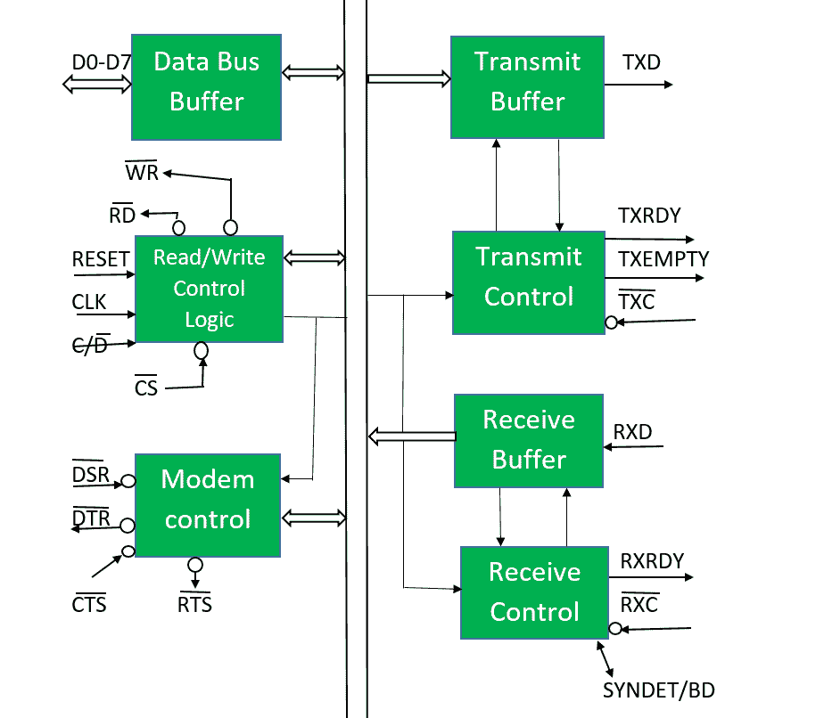
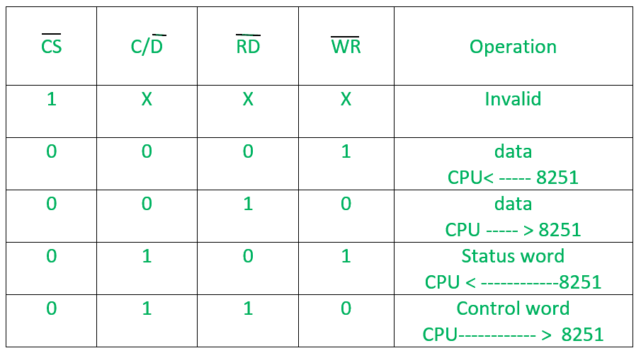

# 微处理器| 8251 USART

> 原文:[https://www.geeksforgeeks.org/microprocessor-8251-usart/](https://www.geeksforgeeks.org/microprocessor-8251-usart/)

先决条件–[8259 PIC 微处理器](https://www.geeksforgeeks.org/8259-pic-microprocessor/)
8251 通用同步异步接收发送器(USART)作为微处理器和外设之间的媒介，将串行数据传输为并行形式，反之亦然。

1.  它从外围设备(外部设备)串行获取数据，并转换成并行数据。
2.  将数据转换成并行形式后，传输给 CPU。
3.  同样，它从微处理器接收并行数据，并将其转换为串行形式。
4.  将数据转换成串行形式后，传输到外部设备(外设)。

**8251 USART–**框图

它包含以下块:

1.  **数据总线缓冲器–**
    该模块有助于将 8251 的内部数据总线连接到系统数据总线。通过数据总线缓冲块，8251 和中央处理器之间可以进行数据传输。
2.  **Read/Write control logic –**
    It is a control block for overall device. It controls the overall working by selecting the operation to be done. The operation selection depends upon input signals as:

    

    这样，该单元从三个寄存器中选择一个——数据缓冲寄存器、控制寄存器和状态寄存器。

3.  **调制解调器控制(调制器/解调器)–**
    一种设备将模拟信号转换成数字信号，反之亦然，并帮助计算机通过电话线或电缆进行通信。以下是调制解调器的低电平有效引脚。
    *   **DSR:** 数据集就绪信号是输入信号。
    *   **DTR:** 数据端子就绪为输出信号。
    *   **CTS:** 是控制数据传输电路的输入信号。
        **RTS:** 是用于设置 RTS 状态的输出信号。
4.  **发送缓冲器–**
    该模块用于并串转换器，接收并行字节，转换为串行信号，并进一步传输到公共通道。
    *   **TXD:** 它是一个输出信号，如果它的值为 1，意味着变送器将传输数据。
5.  **传输控制–**
    该模块通过以下引脚控制数据传输:
    *   **TXRDY:** 表示变送器准备好传输数据字符。
    *   **TXEMPTY:** 一个输出信号，表示 TXEMPTY 引脚已经传输了所有数据字符，现在变送器为空。
    *   **TXC:** 控制传输数据的数据传输速率的低电平有效输入引脚。
6.  **接收缓冲区–**
    该块充当接收数据的缓冲区。
    *   **RXD:** 接收数据的输入信号。
7.  **接收控制–**
    该模块控制接收数据。
    *   **RXRDY:** 输入信号表示准备接收数据。
    *   **RXC:** 控制接收数据的数据传输速率的低电平有效输入信号。
    *   **SYNDET/BD:** 输入或输出端子。外部同步模式输入端和异步模式输出端。