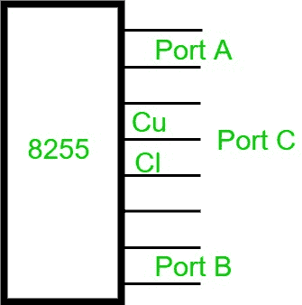
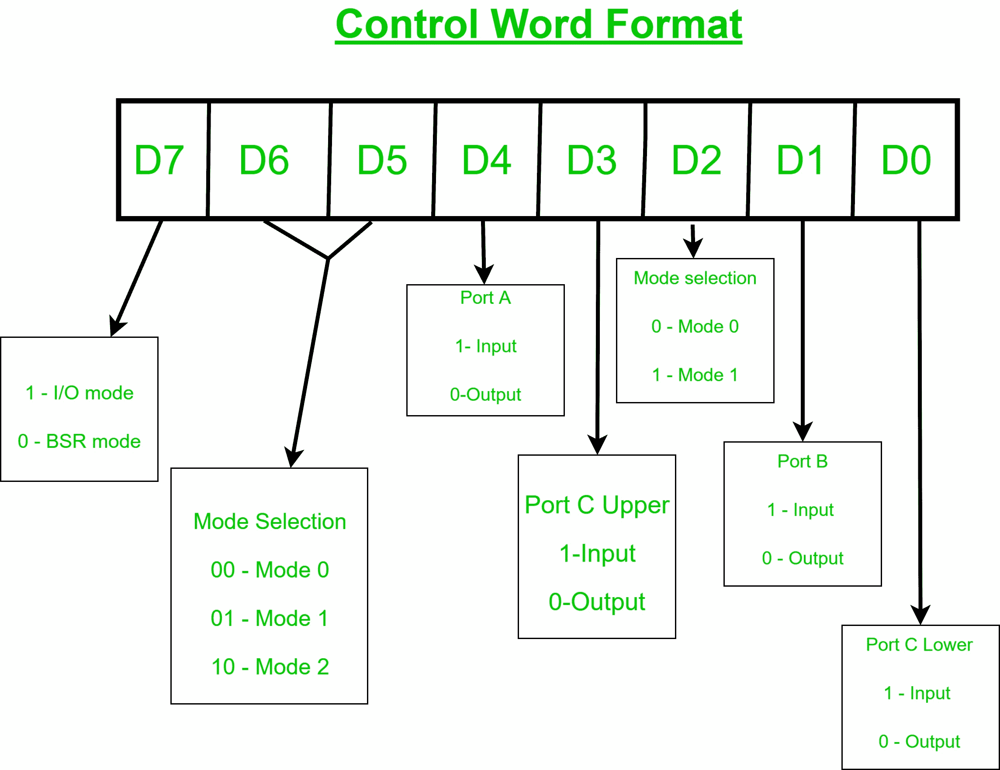

# 微处理器| 8255(可编程外设接口)

> 原文:[https://www . geesforgeks . org/microprocessor-8255-可编程-外设-接口/](https://www.geeksforgeeks.org/microprocessor-8255-programmable-peripheral-interface/)

**8255** 是一种常用的并行可编程输入输出设备。它可用于从简单输入输出到中断输入输出的各种条件下的数据传输。这是一种经济、实用、灵活但有点复杂的通用 i/o 设备，几乎可以与任何微处理器一起使用。

**8255 引脚图–**
它有 24 个引脚，可以分成两个 8 位并行端口:A 和 B 称为端口 A(PA)和端口 B(PB)，其余 8 个称为端口 C(PC)。端口 C 可以进一步分为名为 Cupper(Cu)和 Clower(Cl)的 4 位端口组。共有 40 个引脚，采用+5 稳压电源供电。

**8255 的模式–**有两种工作模式:

1.  位设置复位(BSR)模式
2.  输入输出模式

要知道接口在哪个模式下工作，我们需要知道**控制字**的值。控制字是 8255 中控制寄存器的一部分，它为每个端口指定一个输入输出功能。这是控制字 8255 的格式。

如果控制字或 D7 的最高有效位是 1，则 8255 在输入/输出模式下工作，否则，如果它的值是 0，则它在 BSR 模式下工作。

1.  **BSR 模式–**当控制寄存器的 MSB 为零(0)时，8255 以位设置-复位模式工作。在这种模式下，只有 PC 位用于设置和复位。

2.  **输入输出模式–**当控制寄存器的 MSB 为 1 时，8255 工作在输入输出模式，进一步分为三类。

3.  **模式 0–**在该模式下，所有三个端口(PA、PB、PC)都可以作为简单的输入功能或输出功能工作。在该模式下，也没有中断处理功能。

4.  **模式 1–**在这种情况下，端口 A 或端口 B 都可以工作，端口 C 位在实际数据传输之前用作握手信号，此外，它还具有中断处理能力。

5.  **模式 2–**在这种情况下，只有端口 A 工作，端口 B 可以在模式 0 或模式 1 下工作，端口 C 的 6 位用作握手信号，此外，它还具有中断处理能力。

通过 8255 与外设通信需要三个步骤:

1.  根据芯片选择逻辑和地址线 A0 和 A1 确定端口 A、B、C 和控制寄存器的地址。
2.  在控制寄存器中写入控制字。
3.  编写 I/O 指令，通过端口 A、B、c 与外设进行通信

8255 的常见应用有:

*   交通灯控制
*   产生方波
*   与 DC 电机和步进电机接口