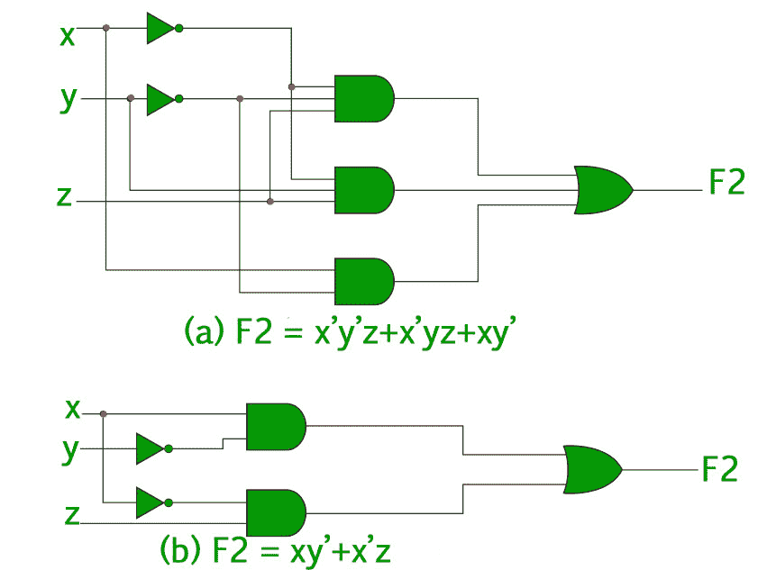
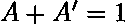
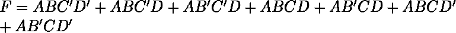
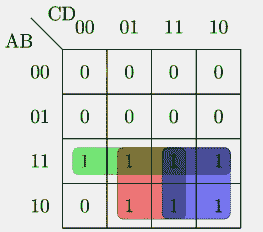

# 布尔函数的最小化

> 原文:[https://www . geesforgeks . org/布尔函数最小化/](https://www.geeksforgeeks.org/minimization-of-boolean-functions/)

正如[“布尔函数的表示”](https://www.geeksforgeeks.org/mathematics-representation-boolean-functions/)中所讨论的，每个布尔函数都可以表示为最小项的和或最大项的乘积。由于这种表达式中的文字数量通常很高，并且实现布尔函数的数字逻辑门的复杂性与实现该函数的代数表达式的复杂性直接相关，因此最好具有代数表达式的最简化形式。
简化布尔函数代数表达式的过程称为**最小化**。最小化很重要，因为它降低了相关电路的成本和复杂性。
比如功能可以最小化为。与上述表达式相关联的电路是–

从上图中可以清楚地看出，该表达式的最小化版本占用了较少数量的逻辑门，并且也大大降低了电路的复杂性。因此，最小化对于找到布尔函数最经济的等价表示非常重要。
最小化可以使用代数操作或 [K-Map](https://www.geeksforgeeks.org/k-mapkarnaugh-map/) 方法完成。每种方法都有自己的优缺点。

**使用代数操作的最小化–**

这个方法是所有最小化方法中最简单的。它适用于包含 4 或 5 个变量的中型表达式。代数操作是手动方法，因此容易出现人为错误。
代数运算中常用的定律:

1.  
2.  
3.  

*   **示例 1–**使用代数操作最小化以下布尔函数-
    

*   **Solution –** Properties refer to the three common laws mentioned above.

    ![ \begin{align*} F=\:&ABC^\prime(D^\prime + D) +AB^\prime C^\prime D + ACD(B + B^\prime) &&\\ &\:+ ACD^\prime(B + B^\prime)&&\\ =\:&ABC^\prime +AB^\prime C^\prime D + ACD +ACD^\prime && \text{Using Property-1}\\ =\:&ABC^\prime +AB^\prime C^\prime D + AC(D +D^\prime )&&\\ =\:&ABC^\prime +AB^\prime C^\prime D + AC && \text{Using Property-1}\\ =\:&A(BC^\prime +C)+AB^\prime C^\prime D &&\\ =\:&A(B+C)+AB^\prime C^\prime D&& \text{Using Property-2}\\ =\:&AB +AC+AB^\prime C^\prime D &&\\ =\:&AB + AC + A C^\prime D && \text{Using Property-2}\\ =\:&AB + AC + AD && \text{Using Property-2}\\ \end{align*} ](img/377ef52a7ec8fd0521ad739870eb60f0.png "Rendered by QuickLaTeX.com")

    **使用 K-Map 最小化–**

    代数操作方法既繁琐又麻烦。K-Map 方法速度更快，可用于求解最多 5 个变量的布尔函数。请参考此[链接](https://www.geeksforgeeks.org/k-mapkarnaugh-map/)了解更多 K-Map。

    *   **示例 2–**考虑示例-1 中的相同表达式，并使用 K-Map 将其最小化。
    *   **解–**下面是给定表达式的 4 变量 K-Map。
        
        上图突出了绿色、红色和蓝色的主要隐含层。
        绿色的跨越整个第三行，给我们–
        红色的跨越 4 格，给我们–
        蓝色的跨越 4 格，给我们–
        所以，最小化的布尔表达式是- 

    **GATE CS 角题**

    练习下列问题将帮助你测试你的知识。所有的问题在前几年的 GATE 考试或 GATE 模拟考试中都被问过。强烈建议你练习一下。

    1. [GATE CS 2012，第 30 题](https://www.geeksforgeeks.org/gate-gate-cs-2012-question-30/)
    2。 [GATE CS 2007，问题 32](https://www.geeksforgeeks.org/gate-gate-cs-2007-question-32/)
    3。 [GATE CS 2014 集-3，问题 17](https://www.geeksforgeeks.org/gate-gate-cs-2014-set-3-question-17/)
    4。 [GATE CS 2005，问题 18](https://www.geeksforgeeks.org/gate-gate-cs-2005-question-18/)
    5。 [GATE CS 2004，问题 17](https://www.geeksforgeeks.org/gate-gate-cs-2004-question-17/)
    6。 [GATE CS 2003，问题 45](https://www.geeksforgeeks.org/gate-gate-cs-2003-question-45/)
    7。 [GATE CS 2002，问题 12](https://www.geeksforgeeks.org/gate-gate-cs-2002-question-12/)

    **参考文献-**

    [K-Map–维基百科](https://en.wikipedia.org/wiki/Karnaugh_map)
    数字设计，第 5 版，作者:莫里斯·马诺和迈克尔·西莱蒂

    本文由**奇拉·曼瓦尼**供稿。如果你喜欢 GeeksforGeeks 并想投稿，你也可以使用[contribute.geeksforgeeks.org](http://www.contribute.geeksforgeeks.org)写一篇文章或者把你的文章邮寄到 contribute@geeksforgeeks.org。看到你的文章出现在极客博客主页上，帮助其他极客。

    如果你发现任何不正确的地方，或者你想分享更多关于上面讨论的话题的信息，请写评论。