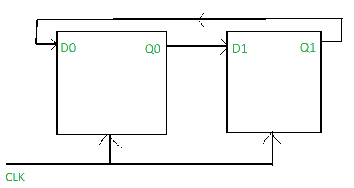
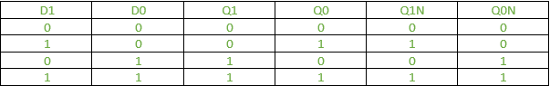
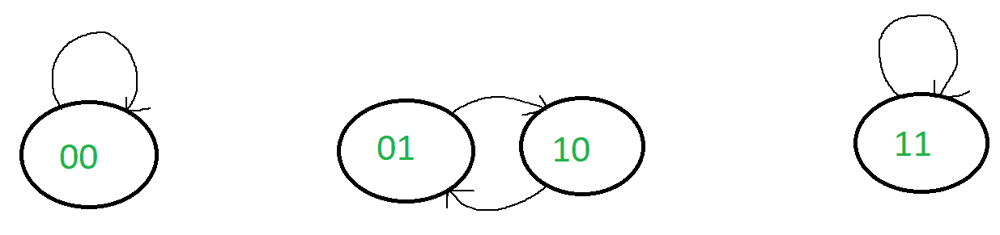

# Mod 2 环形计数器(带 D 触发器)

> 原文:[https://www . geesforgeks . org/mod-2-ring-counter-with-d-flop/](https://www.geeksforgeeks.org/mod-2-ring-counter-with-d-flip-flop/)

[环形计数器](https://www.geeksforgeeks.org/ring-counter-in-digital-logic/)是移位寄存器最重要的应用之一。它们是通过将多个触发器相互连接(使得一个触发器的输出是另一个触发器的输入)以及将最后一个触发器的输出连接到第一个触发器的输入来创建的。

对于 mod 2 环形计数器，需要两个触发器。回想一下，环形计数器可以计数的状态数等于使用的触发器数。由于 mod 2 环形计数器最多可以计数 2 个状态，因此需要 2 个触发器。

因为环形计数器是同步计数器，所以时钟需要处于“开”状态，以便状态转换可以发生，并且环形计数器可以正常工作。

**电路图:**

从图中，我们可以看到 D1 = Q0，D0 = Q1

**表:**
为方便起见，这里将励磁表和状态表合并。

**状态图:**

