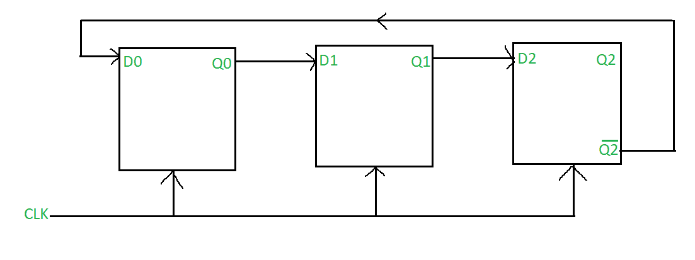
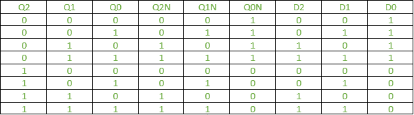
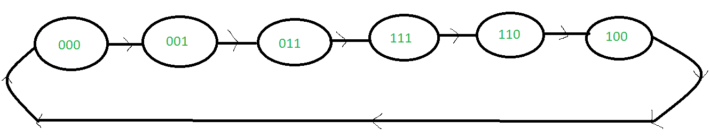

# Mod 6 约翰逊计数器(带 D 触发器)

> 原文:[https://www . geesforgeks . org/mod-6-Johnson-counter-with-d-flop/](https://www.geeksforgeeks.org/mod-6-johnson-counter-with-d-flip-flop/)

[约翰逊计数器](https://www.geeksforgeeks.org/n-bit-johnson-counter-in-digital-logic/)是移位寄存器最重要的应用之一。它们是通过将多个触发器相互连接(使得一个触发器的输出是另一个触发器的输入)以及将最后一个触发器的输出的补码连接到第一个触发器的输入来创建的。

对于 mod 6 约翰逊计数器，需要 3 个触发器。回想一下，约翰逊计数器所需的触发器数量是该计数器已用状态数量的一半。由于 mod 6 约翰逊计数器最多可以计数 6 个状态，因此需要 3 个触发器。

像环形计数器一样，约翰逊计数器是一个同步计数器，因此时钟需要处于“开”状态才能发生状态转换。

**电路图:**

**表:**
为方便起见，这里将励磁表和状态表合并。

**状态图:**

