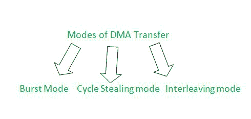

# 直接存储器存取传输模式

> 原文:[https://www.geeksforgeeks.org/modes-of-dma-transfer/](https://www.geeksforgeeks.org/modes-of-dma-transfer/)

在本文中，我们将尝试了解与直接内存访问相关的细节，如直接内存访问是什么或它是如何工作的，此外，我们还将看到直接内存访问传输的各种模式(如突发模式和其他模式)。在直接进入与直接存储器存取传输模式相关的细节之前，让我们先试着了解什么是直接存储器存取，以及这种直接存储器存取实际上是如何工作的。

**直接内存访问(DMA) :**
DMA 基本上代表直接内存访问。这是一个在内存和输入输出设备之间实现数据传输的过程，在数据传输过程中不需要或者可以说不需要中央处理器的参与。


**DMA 的工作:**
以下几点将简要描述 DMA 及其工作如下。

*   对于直接存储器存取，您基本上需要一个称为直接存储器存取控制器的硬件，它将有助于直接在存储器和输入输出设备之间传输数据的整个过程。
*   首先是输入输出设备向直接存储器存取控制器发送直接存储器存取请求，然后直接存储器存取控制器向中央处理器发送保持信号，向中央处理器请求传输数据所需的几个信息。
*   然后，在数据传输之前，中央处理器与直接存储器存取控制器共享两个基本信息:起始地址(从应该执行数据传输的地方开始的存储器地址)和数据计数(要传输的字节或字的数量)。
*   然后，中央处理器将保持确认发送回直接存储器存取控制器，说明直接存储器存取控制器现在可以成功地传递信息。
*   然后，直接存储器存取控制器进一步将直接存储器存取确认(直接存储器存取确认)共享给输入输出设备，这将最终允许输入输出设备以直接和有效的方式从存储器访问或传输数据。

**DMA 传输的模式:**
现在在对 DMA 及其工作原理有了一些简单的了解之后，是时候分析 DMA 传输的模式了。



*   在直接存储器存取传输期间，中央处理器只能执行那些不需要访问系统总线的操作，这意味着大多数中央处理器将处于阻塞状态。
*   中央处理器保持阻塞状态的时间，或者我们可以说中央处理器将给予系统总线的直接存储器存取控制的时间，实际上将取决于以下直接存储器存取传输模式，在此之后，中央处理器将从直接存储器存取控制收回系统总线的控制。

**模式-1 :**
**突发模式–**

*   在这种模式下，数据突发(整个数据或包含数据的块突发)在中央处理器从直接存储器存取控制中控制总线之前被传输。
*   这是最快的直接存储器存取传输模式，因为大量的数据立刻被传输。
*   因为立刻只有大量的数据被传输，所以时间将被大量节省。

**CPU 保持阻塞状态的时间百分比:**
让准备数据的时间为 Tx，传输数据的时间为 Ty。那么 CPU 由于 DMA 而保持阻塞的时间百分比如下。

```
Percentage of time CPU remains in blocked state = Ty * 100% / Tx + Ty
```

**模式-2 :**
**偷循环模式–**

*   速度较慢的输入输出设备需要一些时间来准备数据(或字)，在此期间，中央处理器保持对总线的控制。
*   一旦数据或字准备好，中央处理器将系统总线的控制权交还给直接存储器存取控制器 1 个周期，其中准备好的字被传送到存储器。
*   与突发模式相比，这种模式稍微慢一点，因为它需要一点时间，而这实际上是由输入输出设备在准备数据时消耗的。

**CPU 保持阻塞状态的时间百分比:**
让准备数据的时间为 Tx，传输数据的时间为 Ty。那么 CPU 由于 DMA 而保持阻塞的时间百分比如下。

```
Percentage of time CPU remains in blocked state = Ty * 100% / Tx
```

**模式-3 :**
**交错模式–**

*   只要中央处理器不需要系统总线，那么只有总线控制将交给直接内存分配控制器。
*   在这种模式下，CPU 根本不会因为 DMA 而被阻塞。
*   这是最慢的直接存储器存取传输模式，因为直接存储器存取可能要等很长时间才能从中央处理器本身访问系统总线。
*   因此，传输的数据量会减少。

**示例:**
考虑一个以 2MBPs 速度运行的设备，使用周期窃取模式将数据传输到内存。准备就绪或准备就绪时，将 16 个字节的数据传输到内存需要 2 微秒。那么 CPU 因 DMA 传输而被阻塞的时间百分比是多少？

**解释–**

```
Internal data preparation speed given =          2 MBPs. 
So for preparing 2 MB it takes   ------>           1 second
For preparing 1B it takes           ------->          1 second / 2MB

So now for 16B data preparation it takes ------->1 second  * 16B / 2MB
(after reciprocating Mega will be become micro 

(that is 10^6 will become 10^-6 after reciprocating))
therefore for preparation 16B it takes -------> 8 microseconds

Therefore percentage of time CPU remains blocked in case of 
Cycle Stealing mode = 2 * 100% / 8 = 25% 
```