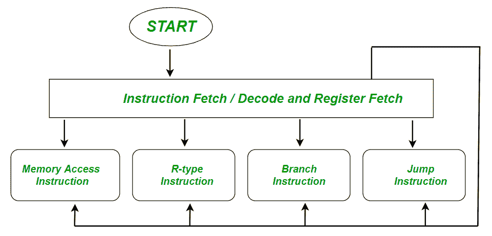

# 多周期数据路径和控制

> 原文:[https://www . geesforgeks . org/多周期数据路径和控制/](https://www.geeksforgeeks.org/multi-cycle-data-path-and-control/)

**概述**:

***多周期数据路径*** 将指令分解成单独的步骤。它减少了平均指令时间。每个步骤需要一个时钟周期每个功能单元在一条指令中可以使用不止一次，只要它在不同的时钟周期中使用。它减少了所需的硬件数量。



**(一)取指令:**

通过向存储器提供相应给定指令的地址，将存储在存储器中的指令提取到中央处理器的控制单元中。

*   假设每条指令都存储在一个字中，并且每个字都有 4 个字节，因此我们可以说这里的内存是字节可寻址的。
*   我们知道，程序计数器包含下一个即将到来的指令的地址。

> IR <= [[PC]]，PC <= [PC] + 4

**(二)解码(解释指令):**

处理器的控制单元解码指令，以便找到执行相应指令所需的操作序列。

*   读取操作码以确定指令类型和字段长度。
*   然后，从所有必要的寄存器中读入数据。

**示例:**

> a < = Reg[IR[25:21]]；//操作码中的寄存器 rs(指令部分)
> 
> b < = Reg[IR[25:21]]；//操作码中的寄存器 rt(指令部分)

**(三)执行、内存地址计算或分支指令:**

**示例:**

```
Memory Reference : ALUout <=   A + sign-extend ( IR[15:0] )
Branch : if (A == B)   PC  <=  ALUout     // Conditional , it will calculate PC= Register + Branch Address
Jump :  PC  <=  PC [ 31:28 ] . ( IR [25 : 0] << 2 )    //// unconditional
```

**(四)内存访问/ R 型指令完成步骤:**

**示例:**

```
Memory Reference:  MDR  <=  Memory [ALUout ];    // LOAD  or  Memory [ALUout ]  <=  B;    // Store from register to memory
Arithmetic Logic Instruction (R-type) :  Reg [ IR[15:11]]  <=  ALUout ;      // register destination in opcode
```

**(五)存储器读取完成步骤(寄存器写入):**

*   大多数指令将一些计算的结果写入寄存器。
*   **示例:**算术、逻辑、移位、负载等。**负载:Reg [ IR [20:16]] < = MDR**
*   **存储、分支、跳转**在末尾不写入寄存器，保持空闲。

**示例:**

**Q1。**查找
的数据路径和控制阶段(执行顺序)添加 R1、R2、R3；
表示 R3<–R1+R2

解决方案:给出指令<u>–添加 R3、R1、R2；</u>

*   <u>阶段 1:获取指令并增加程序计数器。</u>
*   <u>阶段 2:解码以确定它是加法指令，并读取寄存器 R1 和 R2。</u>
*   <u>阶段 3:将阶段 2 中检索到的两个值相加。</u>
*   <u>第四阶段:空闲(没有东西可以写入内存)</u>
*   <u>阶段 5:将阶段 3 的结果写入寄存器 R3。</u>

<u>**Q2。**查找 R2 MOV 30(R1)
的数据路径和控制阶段(执行顺序)；
表示【30+R1】<–R2</u>

<u>解决方案:给定指令-R2 MOV 30(R1)；</u>

*   <u>阶段 1(提取) :提取指令并增加程序计数器。</u>
*   <u>阶段 2(解码) :解码以找到相应的指令是 MOV，并读取寄存器 R1 和 R2</u>
*   <u>阶段 3(执行) :在相应的 R1 寄存器中添加 30。</u>
*   <u>第 4 阶段(内存访问) :将寄存器 R2 中的值写入第 3 阶段计算的内存地址。</u>
*   <u>阶段 5(寄存器写) :该步骤是空闲的(寄存器中没有要写的内容)</u>