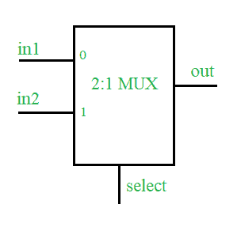

# 使用 Verilog HDL 的多路复用器设计

> 原文:[https://www . geesforgeks . org/multiplexer-design-use-verilog-HDL/](https://www.geeksforgeeks.org/multiplexer-design-using-verilog-hdl/)

先决条件–[数字逻辑中的多路复用器](https://www.geeksforgeeks.org/multiplexers-in-digital-logic/)
**问题:**
使用 Verilog 硬件描述语言和测试平台设计 2:1 多路复用器。

**概念:**
多路复用器是一种组合型数字电路，用于将一条可用的输入线传输到单个输出端，并且必须将哪个输入端传输到输出端将由选择线信号的状态(逻辑 0 或逻辑 1)决定。2:1 多路复用器有两个输入，一条选择线(选择两个输入之一)和一个输出。



**真值表–**

<figure class="table">

| 挑选 | 在外 |
| Zero | in1 |
| one | in2 |

**2:1 多路复用器的 Verilog 高密度脂蛋白代码:**

**设计–**

```
// define a module for the design
module mux2_1(in1, in2, select, out);

// define input  port
input in1, in2, select;

// define the output port
output out;

// assign one of the inputs to the output based upon select line input
assign out = select ? in2 : in1;
endmodule :mux2_1
```

**测试平台–**

```
module test;
reg in1, in2, select;
wire out;

// design under test 
mux2_1 mux(.in1(in1), .in2(in2), 
            .select(select), .out(out));

// list the input to the design
initial begin in1=1'b0;in2=1'b0;select=1'b0; 
        #2    in1=1'b1;
        #2    select=1'b1;
        #2    in2=1'b1;
        #2    $stop();
        end

// monitor the output whenever any of the input changes
initial begin $monitor("time=%0d, input1=%b, input2=%b, 
                       select line=%b, output=%b", $time, 
                        in1, in2, select, out);
        end
endmodule :test
```

**预期输出–**

```
time=0, input1=0, input2=0, select line=0, out=0
time=2, input1=1, input2=0, select line=0, out=1
time=4, input1=1, input2=0, select line=1, out=0
time=6, input1=1, input2=1, select line=1, out=1 
```

</figure>