# 数字逻辑中的多路复用器

> 原文:[https://www . geesforgeks . org/数字逻辑多路复用器/](https://www.geeksforgeeks.org/multiplexers-in-digital-logic/)

它是一种组合电路，根据控制或选择输入，有多个数据输入和单个输出。对于 N 条输入线，记录 n (base2)条选择线，或者我们可以说对于 2 n 条输入线，需要 N 条选择线。多路复用器也称为**“数据 n 选择器、并串转换器、多对一电路、通用逻辑电路”**。多路复用器主要用于增加在一定时间和带宽内通过网络发送的数据量。

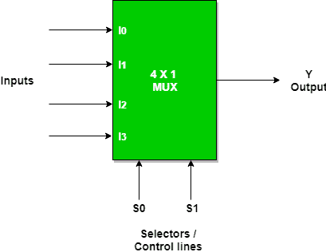

现在实现 4:1 多路复用器使用真值表和门。

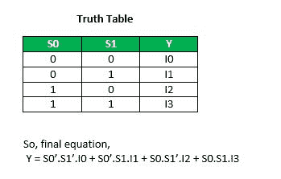

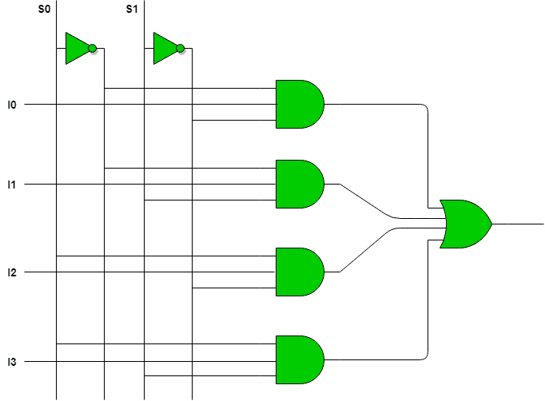

多路复用器可以作为通用组合电路。所有标准逻辑门都可以用多路复用器来实现。

**a)使用 2 : 1 多路复用器实现非门**

**非门:**

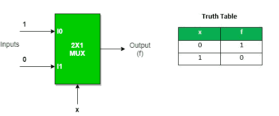

我们可以分析一下
Y = x . . 1+x . 0 = x '
使用 2:1 MUX 不是门。
非门的实现使用“n”条选择线完成。它不能使用“n-1”选择线来实现。只有非门不能使用“n-1”选择线实现。

**b)使用 2 : 1 多路复用器实现与门**

**与门**

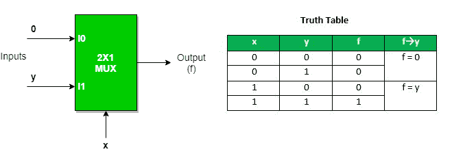

这个实现是使用“n-1”选择线完成的。

**c)使用“n-1”选择线使用 2 : 1 多路复用器实现或门。**

**或门**

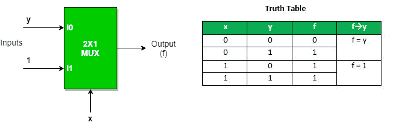

与非门、或非门、异或门和 XNOR 门的实现需要两个 2:1 多路复用器。第一多路复用器将作为非门，向第二多路复用器提供补充输入。

**d)使用 2 : 1 多路复用器实现与非门**

**与非门**

**e)使用 2 : 1 多路复用器实现或非门**

**或非门**

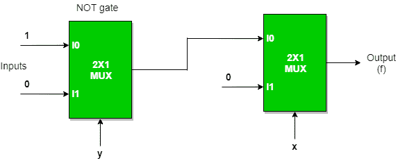

**f)使用 2 : 1 多路复用器实现异或门**

**异或门**

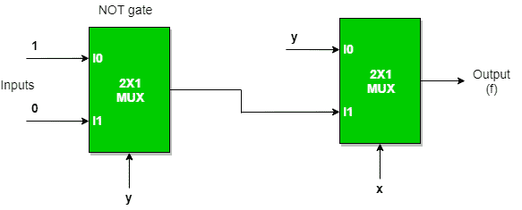

**g)使用 2 : 1 多路复用器实现异或非门**

**异或非门**

**使用低阶多路复用器实现高阶多路复用器**

**a)使用 2 : 1 多路复用器的 4 : 1 多路复用器**

**实现 4 : 1 多路复用器需要三(3)** 个 2 : 1 多路复用器。

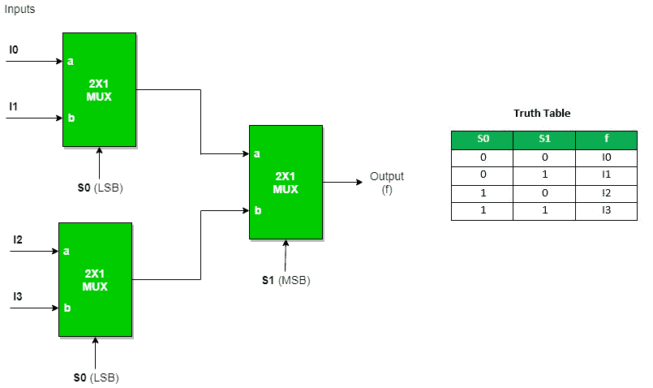

同样的，

8 : 1 多路复用器需要**七(7)** 2 : 1 多路复用器，16 : 1 多路复用器需要**十五(15)** 2 :1 多路复用器，64 : 1 多路复用器需要**六十三(63)** 2 : 1 多路复用器。
因此，我们可以得出一个结论，
2 n : 1 MUX 需要**(2^n–1)**2:1 mux。

**b)使用 4 : 1 多路复用器的 16 : 1 多路复用器**

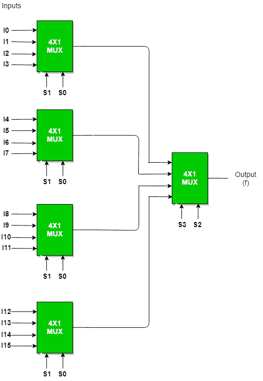

一般来说，要使用 A : 1 多路复用器实现 B : 1 多路复用器，使用一个公式来实现相同的功能。
B / A = K1，
K1/ A = K2，
K2/ A = K3

………………

K N-1 / A = K N = 1(直到我们获得 1 个多路复用器计数)。

然后把所有 mux 的个数相加= K1 + K2 + K3 + …。+ K N 。
例如:用 4 : 1 MUX 实现 64:1 MUX
使用上面的公式，我们可以得到相同的结果。
64 / 4 = 16
16 / 4 = 4
4 / 4 = 1(直到我们获得 1 个多路复用器计数)
因此，需要 4 : 1 多路复用器的总数来实现 64 : 1 多路复用器= 16 + 4 + 1 = 21。

**使用多路复用器给出了一个实现布尔函数的例子，如果最小和无关项。**
f ( A，B，C)=σ(1，2，3，5，6)与不在意(7)使用 4 : 1 MUX 使用 as
**a) AB 作为 select** :将最小项展开为其布尔形式，并将在 Cth 位置看到其 0 或 1 值，以便可以以这种方式放置它们。

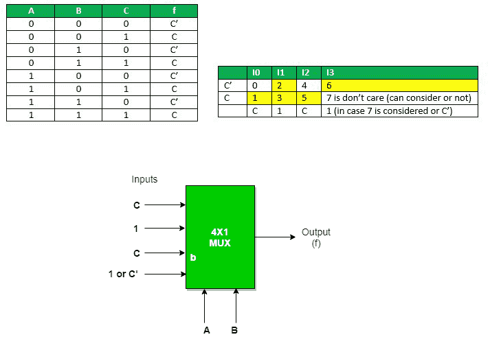

**b) AC as select** :将最小项展开为其布尔形式，并将在 Bth 位置看到其 0 或 1 值，以便它们可以以这种方式放置。

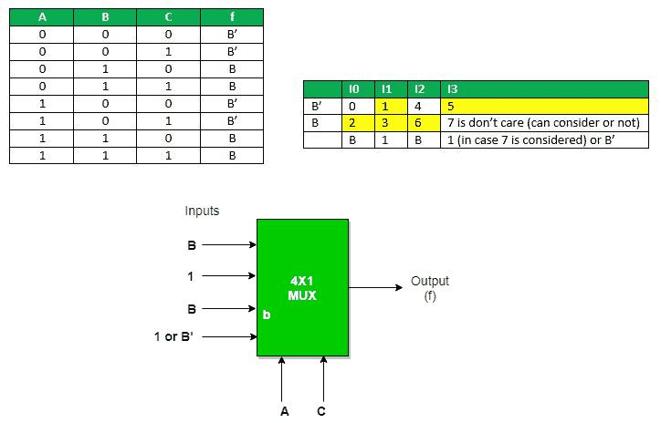

**c) BC as select** :将最小项展开为其布尔形式，并将在第一个位置看到其 0 或 1 值，以便它们可以以这种方式放置。

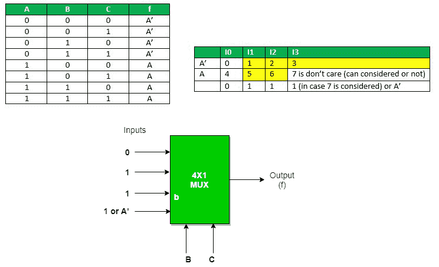

本文由**苏穆利·乔杜里供稿。**