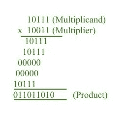
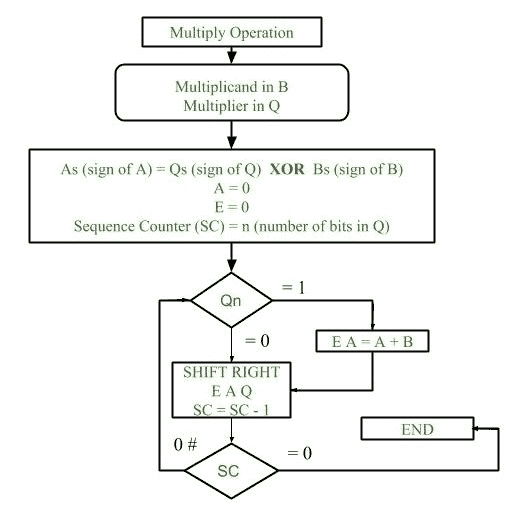
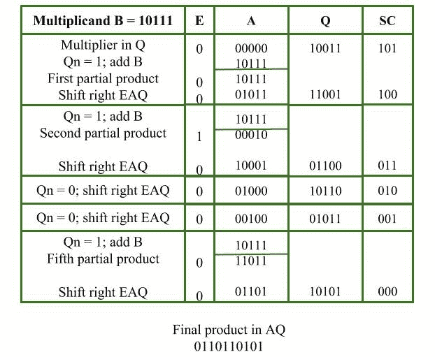

# 符号幅度表示中的乘法算法

> 原文:[https://www . geeksforgeeks . org/乘法-符号幅度算法-表示法/](https://www.geeksforgeeks.org/multiplication-algorithm-in-signed-magnitude-representation/)

*符号幅度表示*中两个定点二进制数的相乘是通过*连续移位*和*加法运算*完成的。



在乘法过程中，我们考虑乘法器的连续位，最低有效位优先。
如果乘数位为 1，被乘数向下复制，否则 0 向下复制。

连续行中向下复制的数字从前一个数字向左移动一个位置。
最后数相加，它们的和形成乘积。

乘积的符号由被乘数和乘数的符号决定。如果它们相似，则产品的符号为正，否则为负。

**硬件实现:**
乘法算法的*硬件实现*需要以下组件:


1.  **寄存器:**
    两个寄存器 B 和 Q 分别用于存储被乘数和乘数。
    寄存器 A 用于存储乘法时的部分积。
    序列计数器寄存器(SC)用于存储乘法器中的位数。
2.  **触发器:**
    为了存储寄存器的符号位，我们需要三个触发器(A 符号、B 符号和 Q 符号)。
    触发器 E 用于存储部分积加法过程中产生的进位位。
3.  **补码和并行加法器:**
    该硬件单元用于计算部分积，即执行所需的加法。

**乘法流程图:**



1.  最初被乘数存储在 B 寄存器，乘数存储在 Q 寄存器。
2.  Sign of registers B (Bs) and Q (Qs) are compared using **XOR** functionality (i.e., if both the signs are alike, output of XOR operation is 0 unless 1) and output stored in As (sign of A register).

    **注意:**最初 0 分配给寄存器 A 和 E 触发器。序列计数器用值 n 初始化，n 是乘法器中的位数。

3.  现在检查乘法器的最低有效位。如果为 1，将寄存器 A 的内容与被乘数(寄存器 B)相加，结果被分配到寄存器 A 中，触发器 E 中的进位位。E 的内容向右移动一个位置，即 E 的内容被移动到 A 的最高有效位，A 的最低有效位被移动到 Q 的最高有效位
4.  如果 Qn = 0，则仅以类似的方式对 E A Q 的内容执行右移操作。
5.  序列计数器的内容减 1。
6.  检查顺序计数器(SC)的内容，如果是 0，结束该过程，最终产品出现在寄存器 A 和 Q 中，否则重复该过程。

**示例:**

```
Multiplicand = 10111
Multiplier = 10011 
```

