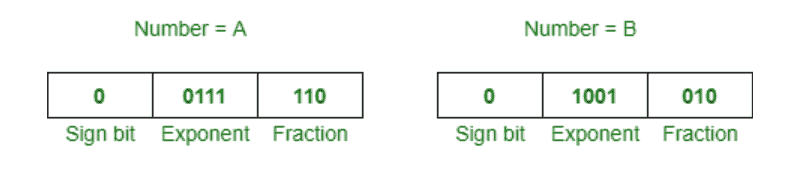
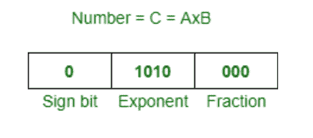

# 乘以浮点数

> 原文:[https://www . geesforgeks . org/乘法-浮点数/](https://www.geeksforgeeks.org/multiplying-floating-point-numbers/)

先决条件–[IEEE 标准 754 浮点数](https://www.geeksforgeeks.org/ieee-standard-754-floating-point-numbers/)
**问题:-**
这里，我们讨论了两个浮点数 x 和 y 相乘的算法。

**算法:-**

1.  用科学符号转换这些数字，这样我们就可以显式地表示隐藏的 1。
2.  假设 a 是 x 的指数，b 是 y 的指数。
3.  假设得到的指数 c = a+b，可以在下一步后进行调整。
4.  把 x 的尾数乘以 y 的尾数，这个结果叫做 m
5.  如果 m 没有一个左 1 的基点，那么调整基点使它有，并调整指数 c 来补偿。
6.  将符号位 mod 2 相加，得到乘积的符号。
7.  转换回一个字节的浮点表示，如果需要，截断位。

**注意:**
在浮点乘法中，负值很容易处理。将符号位视为 1 位无符号二进制，添加 mod 2。这与异或符号位相同。

**例:-**
假设你想乘以以下两个数字:

现在，这些是根据上述算法的步骤:

1.  假设 A = 1.11 x 2^0，B = 1.01 x 2^2
2.  所以，指数 c = a + b = 0 + 2 = 2 就是最终的指数。
3.  现在，用 1.11 乘以 1.01，结果将是 10.0011
4.  我们需要将 10.0011 归一化为 1.00011，并将指数 1 适当调整 3。
5.  结果符号位 0(异或)0 = 0，表示正。
6.  现在，截断并归一化它 1.00011 x 2^3 到 1.000 x 2^3.

因此，结果数是，

同样，我们可以乘以其他浮点数。