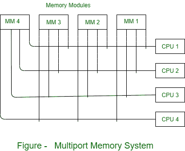

# 多端口内存多处理器系统

> 原文:[https://www . geesforgeks . org/多端口-内存-多处理器-系统/](https://www.geeksforgeeks.org/multiport-memory-multiprocessor-system/)

**多端口内存系统**在每个内存模块和每个中央处理器之间采用独立的总线。处理器总线包括与存储器通信所需的地址、数据和控制线。每个内存模块连接每个处理器总线。在任何给定时间，内存模块都应该具有内部控制逻辑，以获得哪个端口可以访问内存。

内存模块可以说有四个端口，每个端口容纳一条总线。为每个内存端口分配固定的优先级可以解决内存访问冲突。通过其总线在每个模块中占据的物理端口位置，为与每个处理器相关联的存储器访问建立优先级。因此，CPU 1 可以优先于 CPU 2，CPU 2 可以优先于 CPU 3，CPU 4 可以具有最低优先级。

**优势:-**
多路径可以实现高传输速率

**劣势:-**

*   它需要昂贵的内存控制逻辑和大量的电缆和连接器。
*   它仅适用于处理器数量较少的系统。