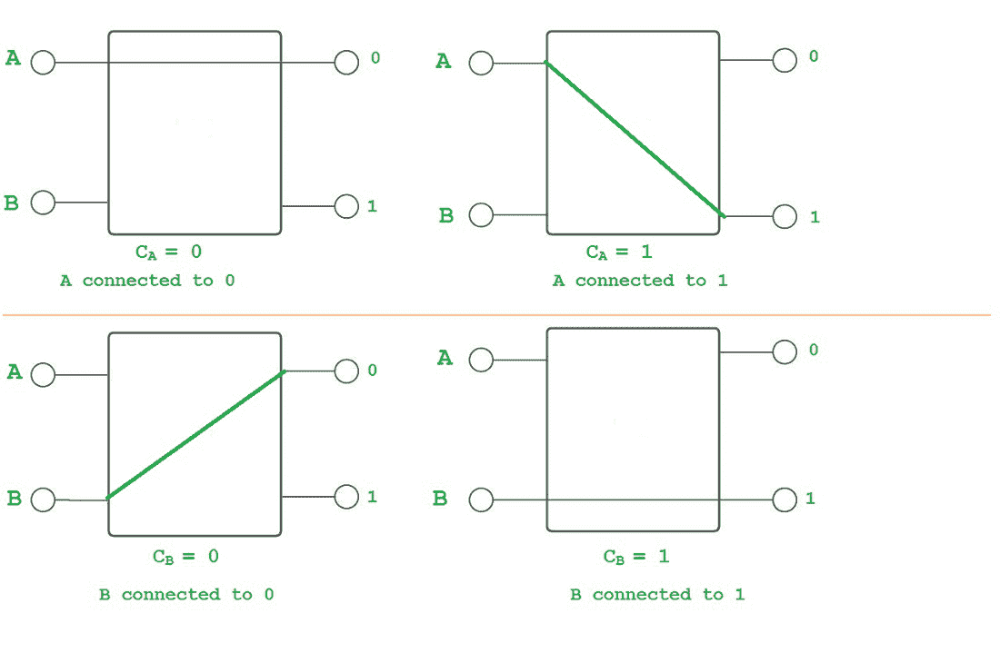
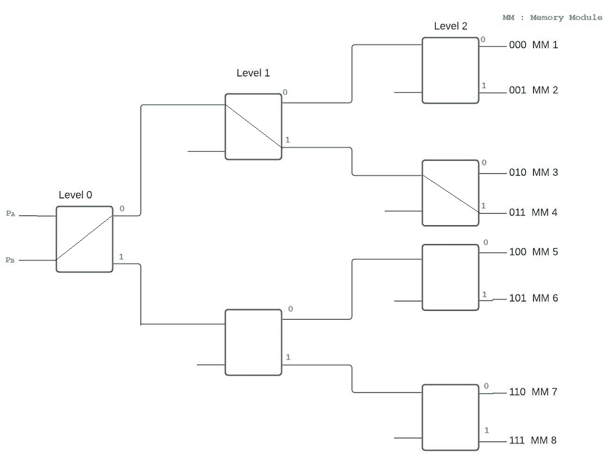

# 多级交换网络——多处理器系统中的互连结构

> 原文:[https://www . geesforgeks . org/多级-交换-网络-互连-多处理器系统中的结构/](https://www.geeksforgeeks.org/multistage-switching-network-interconnection-structure-in-multiprocessor-system/)

在本文中，我们将讨论常用的互连结构，但在这一部分中，我们将更详细地关注多级交换网络。下面我们一个一个来讨论。

**概述:**
处理器必须能够在多处理器系统中共享一组主内存模块& I/O 设备。这种共享能力可以通过互连结构来提供。常用的互连结构可以给出如下。

1.  [时间共享/公共总线(之前讨论过)](https://write.geeksforgeeks.org/post/2699988)
2.  [横杆开关](https://www.geeksforgeeks.org/crossbar-switch/)
3.  [多端口存储器](https://www.geeksforgeeks.org/multiport-memory-multiprocessor-system/)
4.  多级交换网络
5.  [超立方体系统](https://www.geeksforgeeks.org/hypercube-interconnection/#:~:text=Related%20Articles&text=Hypercube%20(or%20Binary%20n%2Dcube,a%20node%20of%20the%20cube.)

下面我们一个一个来讨论。

1.  **分时/公共总线:**
    在多处理器系统中，分时总线互连提供了连接所有功能单元的公共通信路径。

2.  **交叉开关:**
    如果公共总线系统中的总线数量增加，则到达每个内存模块都有单独路径可用的点。交叉开关(对于多处理器)为每个模块提供了单独的路径。

3.  **多端口内存:**
    在多端口内存系统中，控制、交换&优先级仲裁逻辑分布在交叉开关矩阵中，交叉开关矩阵分布在内存模块的接口处。

4.  **超立方体互联:**
    这是一个二元 n 立方体架构。在这里，我们可以连接 2 个 n 处理器，这里的每个处理器构成了立方体的一个节点。节点可以是内存模块，也可以是输入/输出接口，不一定是处理器。一个节点上的处理器有一条直接通向 n 个其他节点(总共 2 个 n 个节点)的通信路径。总共有 2 个不同的 n 位二进制地址。

5.  **多级交换网络:**

*   多级网络采用 2×2 纵横制交换机。它有 2 个输入(A & B)和 2 个输出(0 和 1)。为了建立输入和输出端子之间的连接，控制输入 C A & C B 是相关联的。

2 * 2 纵横制交换机

*   如果控制输入为 0，则输入连接到 0 输出，如果控制输入为 1，则输入连接到 1 输出。这个开关可以在冲突的请求之间进行仲裁。如果两个 A & B 需要相同的输出端，则仅连接一个，另一个将被阻止/拒绝。
*   我们可以使用 2×2 个交换机构建一个多级网络，以便控制多个源和目的地之间的通信。创建一个交叉开关的二叉树来完成连接，将输入连接到 8 个可能的目的地之一。

使用 2*2 开关的 1 至 8 路开关

*   上图中，P A & P B 为 2 个处理器，通过开关从 000(0)到 111(7)二进制连接 8 个内存模块。从源头到目的地有三个层次。为了选择一个级别的输出，三个级别中的每一个都分配了一位。目的号码有 3 位:第 1 位决定第 1 级开关的输出，第 2 位决定第 2 级开关的输出&第 3 位决定第 3 级开关的输出。
*   举例:如果来源是:PBT4，目的地是内存模块 011(如图):从 P B 到第一级输出 0，第二级输出 1&到第三级输出 1 形成一条路径。
*   通常，在紧密耦合的系统中，处理器充当源，存储单元充当目的地。目标是内存模块。但是，在松散耦合的系统中，处理单元既是源又是目的。
*   使用 2×2 的开关，如欧米茄网络、蝶形网络等，可以制作许多图案。

**结论:**
互连结构可以决定多处理器环境下系统的整体性能。为了克服普通总线系统的缺点，即只有 1 条路径可用&降低了其他互连结构的复杂性(交叉开关具有 0(n2的复杂性)，多级交换网络应运而生。他们使用更小的开关，即 2×2 开关来降低复杂性。要设置交换机，可以使用路由算法。它的复杂性和成本都低于交叉杆互连网络。