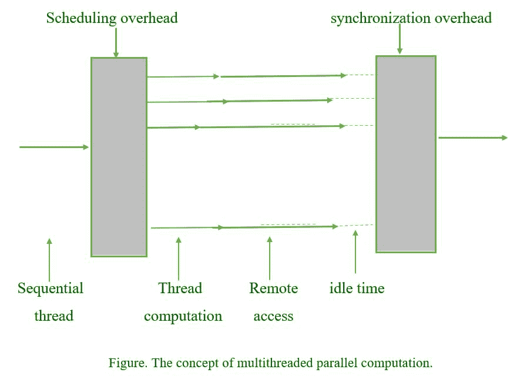

# 多线程和延迟隐藏

> 原文:[https://www . geeksforgeeks . org/多线程和延迟隐藏/](https://www.geeksforgeeks.org/multithreading-and-latency-hiding/)

在计算机体系结构中，[多线程](https://www.geeksforgeeks.org/multithreading-in-operating-system/)是指中央处理器(CPU)(或多核处理器中的一个核)在操作系统支持下并发提供多个执行线程的能力。延迟加密使机器能够执行有用的功能，从而提高机器的使用率。
多线程是指程序或软件进程一次管理一个用户使用它的能力，甚至管理同一用户的多个请求，而不必拥有运行在计算机内的程序的多个副本。多线程是实现延迟隐藏的一种方式。

*   延迟隐藏方法的一般思想是让每个处理器做一些有用的工作，因为它等待远程操作请求得到满足。
*   延迟隐藏:在等待内存访问请求完成时，为每个处理器提供有用的工作。
*   延迟隐藏允许通信与计算完全重叠，从而提高效率和硬件利用率。
*   多线程可能是一种实用的延迟机制。

[多线程](https://www.geeksforgeeks.org/multithreading-in-operating-system/)是减少延迟的有用机制。多线程计算通常从顺序线程开始，然后是一些管理开销，以建立(调度)各种独立线程，然后是单个线程的计算和通信(远程访问)，最后是同步步骤，以在启动下一个单元之前终止线程。

**顺序线程:**
在一个程序中，一个线程是一个单独的顺序控制流。关于线程的真正讨论不是关于一个单一的顺序线程。相反，它指的是在单个程序中使用并发运行并执行不同任务的多个线程。

**调度开销:**
调度算法为确定运行哪个进程而运行的次数称为调度开销。这在多道程序操作系统中是一个开销，因为我们有进程要运行，但也必须决定运行哪个进程。

**远程内存访问:**
计算中的远程直接内存访问(RDMA)是从一台计算机的内存到另一台计算机的内存的直接内存访问，不涉及任何一台计算机的操作系统。这实现了高吞吐量、低延迟的联网，这在大规模并行计算机集群中尤其有益。

**空闲时间:**
理想的时间是在没有中断或计划外问题的情况下完成给定任务所需的时间。在计划和估算时，许多基于时间的估算方法都利用了这个时间刻度。

**同步开销:**
同步开销定义为一个任务等待另一个任务的时间。任务可能在一个明确的障碍上同步，在那里它们都完成一个时间步长。等待其他任务所花费的时间浪费了该任务正在处理的核心。这段等待时间被称为同步开销。
需要注意的是，多线程的使用并不局限于并行处理环境，在单个处理器上也能提供好处。为了提高性能，具有多个独立线程要执行的单处理器可以在每次高速缓存未命中、每次加载、每个指令之后或每个固定大小的指令块之后在它们之间切换。处理器可能需要多个寄存器组(以减少上下文切换开销)和更大的高速缓存(以保存几个线程最近引用的数据)，但好处可能大于成本。Hirata 等人[Hira92]声称，在具有九个功能单元和两个、四个或八个独立线程的处理器中，加速比分别为 2.0、3.7 和 5.8。

**用于延迟隐藏的多线程:示例**

1.  在代码中，让这个函数的主实例访问一对向量元素并等待它们。
2.  同时，这个函数的第二个实例可以在下一个周期内访问另外两个向量元素，以此类推。
3.  在 l 个时间单位之后，其中 l 是内存系统的延迟，主函数实例从内存中获取请求的数据，并可能执行指定的计算。
4.  在接下来的循环中，以下函数实例的信息项到达，依此类推。这样，在每个时钟周期中，我们都能够执行计算。
5.  前面示例中的执行时间表基于两个假设:内存系统能够服务多个未完成的请求，因此处理器能够在每个周期切换线程。
6.  它还要求程序在线程种类中拥有一定的并发规范。
7.  像 HEP 和 Tera 这样的机器依赖于多线程处理器，多线程处理器将在每个周期中切换执行上下文。因此，他们准备好有效地隐藏延迟。

**多线程的优势**

1.  吞吐量增加。单个进程可以处理大量并发计算操作和输入/输出请求。
2.  使用多个处理器以完全对称的方式同时进行计算和输入/输出。
3.  出色的应用响应能力。如果请求可以在自己的线程上启动，应用程序不会冻结或显示“沙漏”。
4.  提高服务器响应能力。大型或复杂的请求或慢速客户端不会阻止其他服务请求
5.  最小化系统资源使用。线程对系统资源的影响最小。
6.  与传统流程相比，线程创建、维护和管理所需的开销更少。

**多线程的缺点**
多线程也有一些常见的缺点

1.  难以理解的调试和测试过程。
2.  结果有时难以预料。
3.  有开销的上下文切换。
4.  出现死锁的可能性更大。
5.  编写程序的难度增加了。
6.  总的来说，复杂性增加了。
7.  共享资源同步(对象、数据)
8.  潜在的死锁“饥饿”:如果设计有缺陷，一些线程可能无法得到服务。
9.  线程构造和同步消耗大量的 CPU/内存。

参考 [<u>多线程机型</u>](https://www.geeksforgeeks.org/multi-threading-model/)[<u>多线程的好处</u>](https://www.geeksforgeeks.org/operating-system-benefits-multithreading/) ，以及 [<u>多任务、多线程和多处理的区别</u>](https://www.geeksforgeeks.org/operating-system-difference-multitasking-multithreading-multiprocessing/) 。