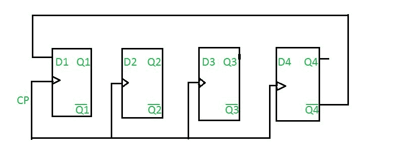
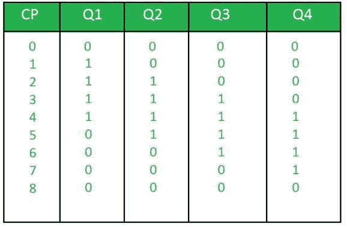

# 数字逻辑中的 n 位约翰逊计数器

> 原文:[https://www . geeksforgeeks . org/n-bit-Johnson-counter-in-digital-logic/](https://www.geeksforgeeks.org/n-bit-johnson-counter-in-digital-logic/)

先决条件–[计数器](https://www.geeksforgeeks.org/counters-in-digital-logic/)

约翰逊计数器又称爬行计数器，是同步计数器的一个例子。在约翰逊计数器中，最后一个触发器的互补输出连接到第一个触发器的输入，为了实现 n 位约翰逊计数器，我们需要 n 个触发器。它是移位寄存器计数器最重要的类型之一。它是由输出对自身输入的反馈形成的。约翰逊计数器是一个带反转的环。约翰逊计数器的另一个名称是:爬行计数器、扭曲环计数器、步行计数器、移动计数器和开关尾计数器。

> n 位 Johnson 计数器中已用和未用状态总数:
> 已用状态数=2n
> 未用状态数= 2n–2 * n

**示例:**
如果 n=4
4 位约翰逊计数器

最初，假设所有触发器都复位。

**真值表:**

其中，
CP 为时钟脉冲，
Q1、Q2、Q3、Q4 为状态。

问题:确定 4 位约翰逊计数器中已用和未用状态的总数。

答:已用状态总数= 2*n
= 2*4
= 8
未用状态总数= 2n–2 * n
= 24-2 * 4
= 8
凡事都有利弊。
**强森计数器的优势:**

*   约翰逊计数器具有相同数量的触发器，但是它可以计数两倍于环形计数器可以计数的状态数。
*   它可以用 D 触发器和 JK 触发器来实现。
*   约翰逊环计数器用于对连续循环中的数据进行计数。
*   约翰逊计数器是一个自解码电路。

**强森计数器的缺点:**

*   约翰逊计数器不按二进制序列计数。
*   在约翰逊计数器中，未使用的状态数多于正在使用的状态数。
*   所需的触发器数量是定时信号数量的一半。
*   它可以为任意数量的时序构建。

**江森计数器的应用:**

*   约翰逊计数器用作同步十进制计数器或除法器电路。
*   它用于硬件逻辑设计，以创建复杂的有限状态机。例如:ASIC 和 FPGA 设计。
*   三级约翰逊计数器用作产生 1200°相移的三相方波发生器。
*   它用于通过改变反馈来划分时钟信号的频率。