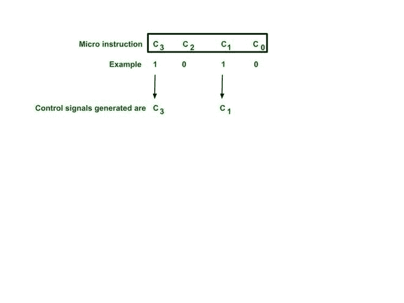
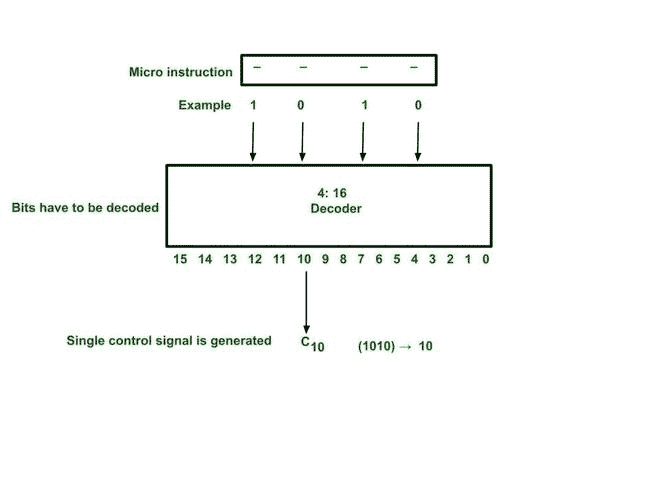
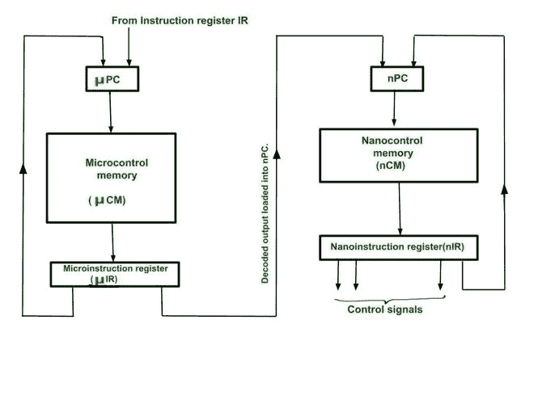

# 微指令格式的纳米编程

> 原文:[https://www . geesforgeks . org/nano-微指令编程-格式/](https://www.geeksforgeeks.org/nano-programming-in-micro-instruction-format/)

在这篇文章中，我们将详细讨论微指令格式的 Nano 编程，并通过例子进行理解，还将讨论 Nano 编程的必要性。我们一个一个来讨论。

**先决条件–**[水平和垂直微指令](https://www.geeksforgeeks.org/difference-between-horizontal-and-vertical-micro-programmed-control-unit/)

**微指令格式:**
微指令的控制域决定要产生的控制信号。它有两种不同的格式水平或垂直。我们一个一个来讨论。

**Type-1 :**
**水平微指令:**
在这里，我们将讨论水平微指令格式如下。

*   微指令的每一位都对应一个控制信号。
*   该位为 1，相应控制信号将由微指令产生。如果微指令中有 N 个位，那么它可以通过该微指令产生 N 个控制信号。
*   随着控制信号的增加，微指令变得更宽。因此，控制内存水平增长。
*   执行速度更快，因为没有使用解码器。
*   控制存储器很大，因为微指令很宽。

**水平微指令格式**

**Type-2 :**
**垂直微指令:**
在这里，我们将讨论垂直微指令格式如下。

*   微指令的位被解码。
*   解码输出决定要产生的控制信号。
*   微指令中的 N 位将总共产生 2 N 个控制信号。
*   但是一条微指令可以产生一个控制。
*   需要更多的微指令。
*   此外，解码会降低执行速度。
*   电路很复杂。

**垂直微指令格式**

**需要纳米编程:**

*   水平微指令可以同时产生多个控制信号，但范围很广。这使得控制存储器非常大。
*   垂直微指令比较窄，但解码后，只产生一个控制信号。这使得控制内存很小，但执行速度很慢。
*   两种方法各有利弊。
*   因此，这两种技术的结合被称为纳米编程。

**纳米编程:**

1.  这里我们有一个两级控制存储器。
2.  指令从主存储器被提取到指令寄存器 IR 中。
3.  使用它的操作码，我们将它的第一条微指令的地址加载到 PC 中，
4.  利用这个地址，我们把微指令从微控存储器(CM)取出，放入微指令寄存器 IR。
5.  这是垂直形式，由解码器解码。
6.  解码输出在纳米程序计数器(nPC)中加载一个新地址。
7.  通过使用该地址，纳米指令从纳米控制存储器(nCM)被提取到纳米指令寄存器(nIR)中。
8.  这是水平形式，可以直接产生控制信号，一次可以是多个。
9.  这样的组合提供了两种技术的优势。
10.  因为微指令是垂直的，所以控制存储器的大小很小。

**纳米编程电路。**

**示例–**

*   假设处理器有 32 条指令(8 条用于算术运算，8 条用于数据传输运算，8 条用于逻辑运算，8 条用于移位运算)。假设我们总共需要 32 个控制信号，其中 8 个负责执行数据传输操作，8 个用于逻辑运算，8 个用于移位运算，8 个用于算术运算。
*   如果我们用水平微指令来实现，那么每个微指令的大小应该是 32 位。最有可能的是，对于数据传输操作，我们不需要其他 3 种指令类型的控制信号，因此在整个微指令中，为不同的 3 种指令类型生成控制信号的 27 位是 0(垃圾)，这使得大量的存储空间被浪费，也控制了存储器大小的增加。
*   如果我们使用纳米编程，那么微控存储器具有通过解码识别指令类型的指令，即使用垂直微指令。在识别指令类型之后，纳米控制存储器负责为先前识别的特定指令类型产生控制信号。因此，其优点是每个纳米指令大小减少到 8 位，每个微指令大小减少到 2 位(用于识别 4 种不同类型的指令和 2×4 解码器)，即垂直微指令的优点我们还可以同时为特定指令类型产生多个控制信号，这是水平指令的优点。

#### Nano 编程的缺点

**增加内存访问时间:-** 两级内存方法的主要缺点是由于 Nano 控制内存需要额外的内存访问而导致速度损失。