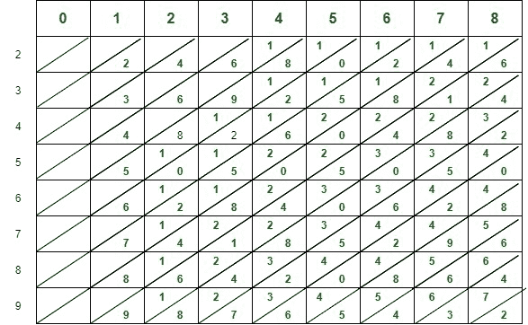

# 纳皮尔骨骼计算器

> 原文:[https://www.geeksforgeeks.org/napier-bones-calculator/](https://www.geeksforgeeks.org/napier-bones-calculator/)

**纳皮尔的骨骼:**T2【它是约翰·耐普尔在 1617 年创造的。它是那个时期发明的较好的计算装置。这是一种手动操作的操作装置，用于计算给定数字的商和积。它看起来像一个棋盘游戏，里面有一个边框。各种各样的杆被放置在轮圈内，用于计算印在杆上的数字。

**纳皮尔棒或骨的种类:**

1.  **索引骨–**
    它用于帮助或对齐条带，也用于识别数字条上的行。
2.  **数字骨骼–**
    它是一个多于一个数字的骨骼，与表示多于一个相同数字的数字所需的骨骼属于同一种类。
3.  **方根骨–**
    而取根需要同时进行 3 次计算，并且骨头上需要 3 列。这些被称为数字的平方。它有助于很容易地做一个数的倍数，也有助于乘法、除法和求平方根。

**示例–**
以下是纳皮尔骨骼计算器如何工作的示例。

*   数字 0-8 写在正方形八列的顶部。
*   对角线把每个正方形分成两半。
*   从 2-9 开始写的数字在盒子的左边。
*   写在每个方框顶部的数字乘以左边的数字。
*   At last, the units of the answer are written at the bottom side of each box or square.

    纳皮尔骨头

**纳皮尔氏棒或骨的特征:**

*   Napier 骨骼计算器由木头、金属和厚纸板组成。
*   纳皮尔骨骼计算器的主要目的是计算给定数字的商和乘积。
*   所有的数学计算，如加法、减法、乘法和除法都是由它来计算和执行的。