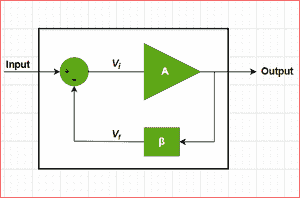

# 放大器需要负反馈

> 原文:[https://www . geesforgeks . org/需要负反馈的放大器/](https://www.geeksforgeeks.org/need-of-negative-feedback-in-amplifiers/)

放大器只是用来增加输入信号强度的电子设备。在这个放大过程中，甚至输入信号中存在的干扰或噪声也会被放大。

这就是我们在放大器中使用负反馈的原因，一部分与输入信号相位相反的输出信号被馈送到放大器的输入端，从而显著降低输出信号中的噪声水平。

**负反馈放大器的框图**

放大器中的负反馈具有以下优点:

**1。稳定放大器增益**

负反馈通过降低放大器增益对各种晶体管参数或电源电压变化的依赖性来稳定放大器的增益。

> **g【VF】= gv/(1+β)。g【v)**
> 
> 这里 **G vf** =负反馈的合成放大器增益
> 
> **G v** =无反馈的放大器增益
> 
> 而 **β** 是<u>反馈分数</u>或<u>反馈比</u>

上面的等式清楚地表明，负反馈的合成放大器增益主要取决于 ***反馈分数或反馈比*** 。

**2。减少非线性失真**

负反馈的使用也降低了大信号放大器中的非线性失真水平。

> **D vf = D / (1 + β)。G v )**
> 
> 这里 **D vf** =负反馈的合成失真水平
> 
> **D** =无反馈的失真等级
> 
> G v =无反馈的放大器增益
> 
> β是反馈分数或反馈比

上述等式清楚地表明，负反馈放大器情况下的失真水平降低了 ***(1 + β)倍。gv)**T5】。*

**3。增加电路稳定性**

没有负反馈的放大器的输出会受到信号的温度、频率或幅度变化的影响，这会进一步改变放大器的增益，因此，我们会在输出中得到失真的信号。因此，应用负反馈使得放大器的增益稳定。

**4。增加输入阻抗/电阻**

负反馈的使用增加了放大器的输入阻抗或电阻。

> 中的**Z’= T4 中的。(1 + β .G v )**
> 
> 这里 **Z'** =负反馈的合成输入阻抗
> 
> **Z** =无反馈输入阻抗
> 
> G v =无反馈的放大器增益
> 
> β是反馈分数或反馈比

上述关系表明，负反馈放大器的输入阻抗增加了***(1 + β)倍。** **G v )*** 。

**5。降低输出阻抗/电阻**

负反馈的使用降低了放大器的输出阻抗或电阻。

> **z‘o= zo/(1+β)。g【v)**
> 
> 这里**Z’o**=负反馈的合成输出阻抗
> 
> **Z o** =无反馈输出阻抗
> 
> G v =无反馈的放大器增益
> 
> β是反馈分数或反馈比

上述关系表明，负反馈放大器的输出阻抗降低了 ***(1 + β)倍。gv)**T5】。*

**6。降低噪音水平**

我们应用于放大器的负反馈与应用的输入信号相位相反，因此它抵消了放大器电路在输出信号中引入的噪声。因此，我们得到的输出信号具有降低的噪声水平。

**7。提高频率响应&带宽**

我们应用于放大器的负反馈是电阻网络，因此具有负反馈的放大器的增益与信号频率无关。结果，增益在很宽的信号频率范围内变得恒定，这样，具有负反馈的放大器的频率响应得到改善。

> **【f】【cf】= f【cf】。(1 + β)。g【v)**
> 
> 这里**f’cf**=负反馈的合成截止频率
> 
> **f cf** =无反馈截止频率
> 
> G v =无反馈的放大器增益
> 
> β是反馈分数或反馈比

上述关系清楚地表明，负反馈放大器的合成截止频率增加了 ***(1 + β)倍。gv)**T5】。因此，在负反馈放大器的情况下，我们获得了更大的可用带宽。*

**8。更多线性操作**

在普通放大器的情况下，即使输入信号的值很小，输出信号的值也很高，因此输出信号与施加的输入信号不成比例。但在负反馈放大器的情况下，每个参数都由应用的反馈网络控制。因此，在具有负反馈的放大器的情况下，输出和输入信号之间的关系更加线性。

由于我们已经讨论了在放大器中使用负反馈的各种优点，所以了解在放大器中使用负反馈的主要缺点是很重要的，即放大器的整体增益降低了 ***(1 + β)的因子。gv)**T5】。*