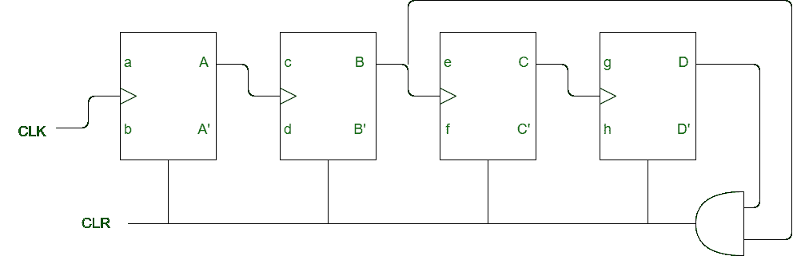
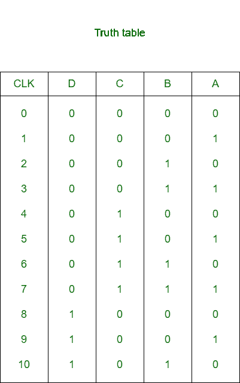

# 数字逻辑中的非二进制计数器

> 原文:[https://www . geesforgeks . org/非二进制-数字逻辑中的计数器/](https://www.geeksforgeeks.org/non-binary-counter-in-digital-logic/)

计数器是对输入出现的次数进行计数的电路。该电路由触发器组成，触发器与组合元件一起用于产生控制信号。

```
If M = Total number of states, and
   n = Total number of flip-flop
Then,      M <= 2n
If         M = 2n    ; Binary counter
and        M < 2n    ; Non-binary counter 
```

**非二进制计数器框图:**
这是一个 mod-10 计数器的框图。这里，所需触发器的总数是 4，因此已用状态的数量是 10，未用状态的数量是 6。



为了设计一个非二进制计数器，需要一个逻辑门来检测 M 级。在 mod-10 coounter 中，从 0000 到 10001 检测到 10 级，一旦 1010 出现，它就会清除所有触发器。

**制作非二进制计数器:**
制作非二进制计数器，

*   如果 CLR 存在，并且 CLK 与输出 Q 相连，那么我们使用与门。
*   如果 CLR 存在，并且 CLK 与输出 Q’相连，那么我们使用或非门。
*   如果 CLR 的补码存在，并且 CLK 与输出 Q 相连，那么我们使用与非门。
*   如果 CLR 的补码存在，并且 CLK 与输出 Q’相连，那么我们使用或门。

**真值表:**



从真值表中可以清楚地看出，一旦 1010 出现，与门的输入变为 11，这就用 CLR =1 复位触发器。

**输出频率:**
mod-M 计数器的输出频率，

```
= f / M 
```

如果最后一个输出(即 D)没有反馈，则输出频率，

```
= f / (2n) 
```