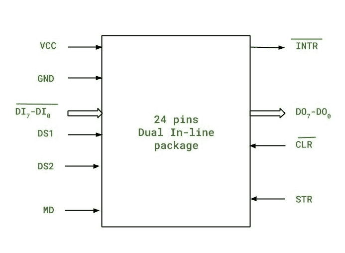
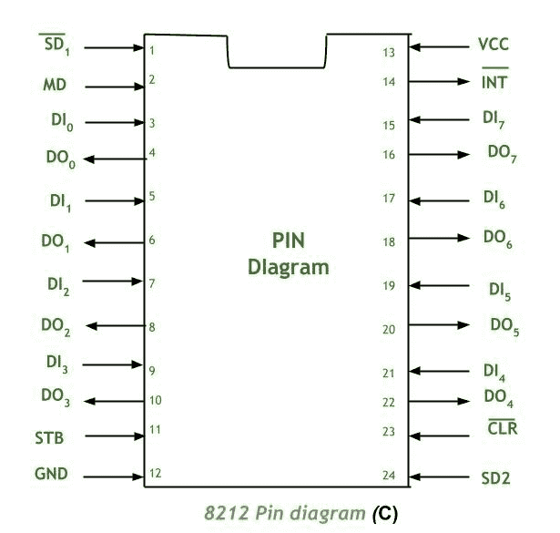

# 不可编程输入/输出端口-英特尔 8212

> 原文:[https://www . geesforgeks . org/不可编程 I-o-port-Intel-8212/](https://www.geeksforgeeks.org/non-programmable-i-o-ports-intel-8212/)

输入和输出端口可以分为可编程端口和不可编程端口。

**可编程端口**是那些需要软件改变才能改变其功能的端口，而**不可编程输入/输出端口**是那些不容易改变功能的端口。为了改变不可编程端口的功能，我们需要对其硬件组件进行改变，或者有时改变整个布线。这些不可编程端口设计简单。

**英特尔 8212 :**
英特尔 8212 就是这样一个受欢迎的不可编程输入/输出端口，它作为具有 24 针的芯片作为双列直插式封装提供。基本结构如下:

8212 的详细引脚图如下:

8212 需要持续+5V DC 电源才能工作。信息由 8 个数据输入引脚(范围从 DI0 到 DI7)上的 8 位锁存器接收，并根据 MD 引脚的状态锁存这些数据输入引脚上的状态信息。锁存的信息来自 8 位数据输出引脚，范围为 DO0-DO7。模式引脚(MD)上存在通过数据输出引脚锁存数据所需满足的条件。

有一个边沿触发的 D 触发器，称为服务请求触发器，它负责将中断请求置于低电平有效的 INTR 引脚上。

**引脚的一般功能:**

| 腿 | 描述 |
| --- | --- |
| VCC | 它是+5V DC 电源。 |
| SD1/SD | 这些是选择器件引脚。 |
| DI7-DI0 | 这是 8 个数据输入引脚，范围从 D7 到 D0。 |
| DO7-DO0 | 这是 8 个数据输出引脚，范围从 D7 到 D0。 |
| 机顶盒(Set-Top-Box) | 它是输入选通引脚。 |
| 医学博士 | 它是输入模式引脚。当为低电平时，即 MD=0，STR 作为 i/p 时钟信号锁存。当为高电平，即 MD=1 时，CS(芯片选择)充当输入时钟。 |
| 周期的 | 是低电平有效中断输出引脚将中断信号置于微处理器上。 |
| 清除（clear 的缩写） | 清除输入的是低电平有效引脚。 |
| GND | 它是接地连接引脚。 |

