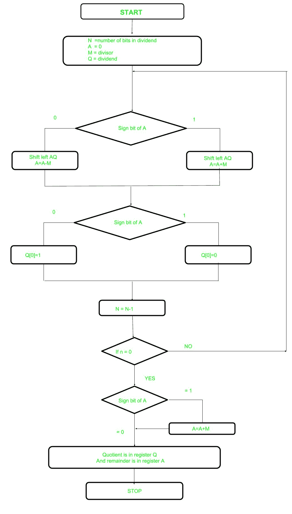

# 无符号整数的不可恢复除法

> 原文:[https://www . geesforgeks . org/非还原-除法-无符号-整数/](https://www.geeksforgeeks.org/non-restoring-division-unsigned-integer/)

在早前的帖子[恢复分裂](https://www.geeksforgeeks.org/restoring-division-algorithm-unsigned-integer/)中了解到恢复分裂。现在，这里执行非恢复除法，它没有恢复除法复杂，因为涉及更简单的操作，即加法和减法，现在也执行恢复步骤。在该方法中，依赖于寄存器的符号位，该位最初包含名为 a 的零

下面是流程图。



让我们选择相关步骤:

*   **步骤-1:** 首先用相应的值初始化寄存器(Q =被除数，M =除数，A = 0，n =被除数的位数)
*   **步骤 2:** 检查寄存器 A 的符号位
*   **步骤-3:** 如果是 AQ 的左移内容，执行 A = A+M，否则左移 AQ，执行 A = A-M(表示将 M 的 2 的补码加到 A，存储到 A)
*   **步骤-4:** 再次是寄存器 A 的符号位
*   **步骤-5:** 如果符号位为 1，Q[0]变为 0，否则 Q[0]变为 1 (Q[0]表示寄存器 Q 的最低有效位)
*   **第 6 步:**将数值减 1
*   **第 7 步:**如果 N 不等于零，进入**第 2 步**否则进入下一步
*   **步骤-8:** 如果 A 的符号位为 1，则执行 A = A+M
*   **Step-9:** Register Q contain quotient and A contain remainder

    **示例:**对无符号整数执行非恢复除法

    ```
    Dividend =11
    Divisor  =3  
    -M =11101

    ```

    | 普通 | M | A | Q | 行动 |
    | --- | --- | --- | --- | --- |
    | four | 00011 | 00000 | One thousand and eleven | 开始 |
    |  |  | 00001 | 011_ | AQ 左移 |
    |  |  | Eleven thousand one hundred and ten | 011_ | A=A-M |
    | three |  | Eleven thousand one hundred and ten | 0110 | Q[0]=0 |
    |  |  | Eleven thousand one hundred | 110_ | AQ 左移 |
    |  |  | Eleven thousand one hundred and eleven | 110_ | A=A+M |
    | Two |  | Eleven thousand one hundred and eleven | One thousand one hundred | Q[0]=0 |
    |  |  | Eleven thousand one hundred and eleven | 100_ | AQ 左移 |
    |  |  | 00010 | 100_ | A=A+M |
    | one |  | 00010 | One thousand and one | Q[0]=1 |
    |  |  | 00101 | 001_ | AQ 左移 |
    |  |  | 00010 | 001_ | A=A-M |
    | Zero |  | 00010 | 0011 | Q[0]=1 |

    ```
    Quotient  = 3 (Q)
    Remainder = 2 (A)

    ```