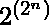
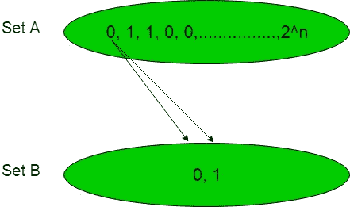
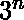
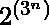
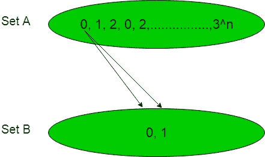
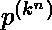

# 布尔函数数量

> 原文:[https://www.geeksforgeeks.org/number-of-boolean-functions/](https://www.geeksforgeeks.org/number-of-boolean-functions/)

在下面的文章中，我们将从给定的二进制数集合中找到[布尔函数](https://www.geeksforgeeks.org/mathematics-representation-boolean-functions/)的可能个数。

**语句-1:**
假设两个集合设置为‘A’= { 1，2，3，4，…..，n}其中每个数字将是“0”或“1”，因此可能的布尔变量总数将是并设置“B”= { 0，1}。现在从集合‘A’到‘B’进行计数时可能的布尔函数的个数将是。

**解释:**
我们知道布尔变量要么是‘0’要么是‘1’，在集合‘A’中有‘n’个数字，每个数字要么是‘0’要么是‘1’，因此可能的布尔变量的总数是。现在设置‘A’包含布尔变量，设置‘B’包含 2 个布尔变量。

借助下图可以理解这一点:

集合“A”的每个元素与集合“B”的每个元素构成一个函数，因此集合“A”的一个元素与集合“B”构成两个函数，因此可能的布尔函数的总数是，其中是集合“A”中的元素数。

**语句-2:**
假设两组三元变量设置为‘A’= { 1，2，3，4，…..，n}其中每个数字将是“0”或“1”或“2”，因此可能的三进制变量的总数将是并设置“B”= { 0，1}。现在从集合‘A’到‘B’进行计数时可能的布尔函数的个数将是。

**解释:**
我们知道三元变量是‘0’或‘1’或‘2’，在集合‘A’中有‘n’个数字，每个数字要么是‘0’或‘1’或‘2’，因此可能的三元变量总数是。现在设置‘A’包含三进制数，设置‘B’包含 2 个布尔变量。

借助下图可以理解这一点:

集合“A”的每个元素与集合“B”的每个元素构成一个函数，因此集合“A”的一个元素与集合“B”构成两个函数，因此可能的布尔函数的总数是，其中是集合“A”中的元素数。

**注:**

> 类似地，对于 k 元变量的“n”个数的集合“A”和 p 元变量的集合“B”，那么 p 元可能函数的总数将是。