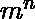
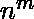
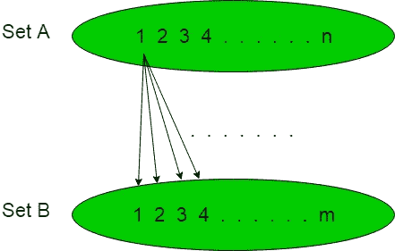
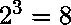
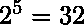
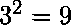
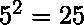
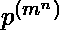

# 可能的功能数量

> 原文:[https://www.geeksforgeeks.org/number-of-possible-functions/](https://www.geeksforgeeks.org/number-of-possible-functions/)

在下面的文章中，我们将从给定的两组元素中计算可能的函数数量。

**语句:**
假设有两个集合‘A’和‘B’分别包含‘n’和‘m’个数的元素，即集合，

```
'A' = {1, 2, 3, 4, ............, n},
'B' = {1, 2, 3, 4, ............, m} 
```

那么当功能从设置‘A’计数到‘B’时，可能的功能数量将是，当功能从设置‘B’计数到‘A’时，可能的功能数量将是。

**说明:**
在下图中，我们可以看到集合‘A’包含‘n’个元素，集合‘B’包含‘m’个元素。集合“A”的每个元素使集合“B”的每个元素具有“m”个功能，因此可能的功能总数为。



**示例:**

1.  如果集合“A”包含“3”个元素，集合“B”包含“2”个元素，那么可能的函数总数将是。
2.  如果集合“A”包含“5”个元素，集合“B”包含“2”个元素，那么可能的函数总数将是。

但是当函数从集合“B”计数到“A”时，公式将是，其中 n、m 分别是集合“A”和“B”中存在的元素数量，那么例子如下:

1.  如果集合“A”包含“3”个元素，集合“B”包含“2”个元素，那么可能的函数总数将是。
2.  如果集合“A”包含“5”个元素，集合“B”包含“2”个元素，那么可能的函数总数将是。

类似地，当两组增加到 3 组时，

```
'A' = {1, 2, 3, 4, ............, n},   
'B' = {1, 2, 3, 4, ............, m} 
'C' = {1, 2, 3, 4, ............, p}  
```

那么当函数从集合‘A’计数到‘B’然后计数到‘C’时，可能的函数的数量将是，以此类推任意数量的集合。