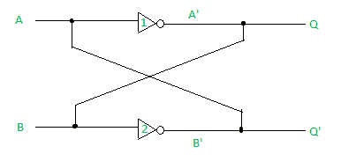

# 一位存储单元(或基本双稳态元件)

> 原文:[https://www . geesforgeks . org/一位存储单元或基本双稳态元件/](https://www.geeksforgeeks.org/one-bit-memory-cell-or-basic-bistable-element/)

**一位存储器**单元也称为**基本双稳态元件**。它有两个交叉耦合的反相器，两个输出 Q 和 Q’。它被称为“双稳态”，因为基本双稳态元件电路具有逻辑 0 和逻辑 1 两种稳定状态。

下图显示了基本双稳态元件:



```
(A) when A=0,
(i) In inverter1, Q = A'= B= 1
(ii)In inverter2, Q' = B' = A = 0

(B) when A=1,
(i) In inverter1, Q = A'= B= 0
(ii)In inverter2, Q' = B' = A = 1 
```

**一些关键点:**

1.  两个输出总是互补的。
2.  电路有两种稳定状态。当 Q=1 时，为**设定状态**。当 Q=0 时，为**复位状态**。
3.  该电路可以存储 1 位数字信息，因此被称为 1 位存储单元。
4.  存储在电路中的一位信息在电路中被锁定或锁存。该电路也称为**闩锁**。

一位六晶体管静态随机存取存储器单元是易失性的。切换速度快是它的主要优势。由于其波动性，它需要持续的电源。对速度更快、密度更高的存储设备的需求已经促使忆阻器被提出来替代闪存、静态随机存取存储器(SRAM)和随机存取存储器(RAM)。忆阻器最显著的特点是其电阻开关能力，即使没有电源，也能长时间保持电阻状态。

一位非易失性存储单元可以使用传输门和忆阻器来设计。忆阻器件具有高开关速度、低能耗、非易失性和小器件尺寸。设计中用作信息存储元件的忆阻器的非易失性在没有电源的情况下提供长达 10 年的保持能力。所使用的传输门确保电压不会通过存储单元的其他组件丢失，从而通过在忆阻器两端提供更大的电势差来提高开关速度。

与基于 NAND 的闪存器件相比，在存储器件中使用忆阻器的其他优点是其长保持期、优异的耐久性和良好的可扩展性。

**参考:**
DIGITAL ELECTRONICS–Atul p . Godse，Deepali A. Godse 夫人
IEEE XPLORE，DIGITAL library–使用忆阻器和传输门的一位非易失性存储单元。