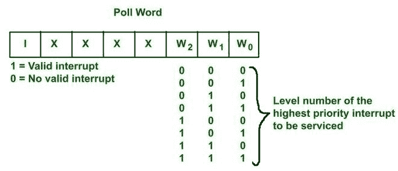

# 8259 PIC 的运行模式

> 原文:[https://www.geeksforgeeks.org/operating-modes-of-8259-pic/](https://www.geeksforgeeks.org/operating-modes-of-8259-pic/)

**先决条件:** [8259 PIC](https://www.geeksforgeeks.org/8259-pic-microprocessor/#:~:text=8259%20combines%20the%20multi%20interrupt,5%20to%208%20interrupt%20levels.)
8259 PIC 是为 8085 和 8086 微处理器的系列设计的。

**8085 和 8086 中需要 PIC:**

*   在 8086 中，我们有两个用于中断处理的引脚，即 NMI 和 INTR。如果我们使用 NMI 处理数据损坏或不可恢复的硬件错误，使用一个中断引脚，INTR 处理其他软件中断。
*   在一个系统中，当我们有来自不同输入或输出设备的多个中断时，那么我们需要一个 PIC(优先级中断控制器)，它可以处理来自不同设备的多个中断，并根据系统要求对它们进行优先级排序，并将它们发送到处理器上的单个中断引脚。

**8259**特点:

*   单个 8259 可以处理 8 个中断，而级联配置的 8259 可以处理多达 64 个中断，其中 1 个主机和 8 个从机。
*   它可以处理边沿级触发中断。
*   它的优先级结构很容易改变。
*   在 8259 中，中断可以单独屏蔽。
*   中断的矢量地址很容易编程。
*   它必须通过给出命令来初始化，以确定各种属性，如矢量数、优先级、屏蔽、触发等。

**8259 的操作模式:**
8259 的不同操作模式可以通过改变 8259 的 ICW 或 OCW 命令的位来编程。

**全嵌套模式**:

*   这是 8259 的默认操作模式。
*   这里，IR 0 优先级最高，IR 7 优先级最低。当发生任何中断请求时，首先服务最高优先级的中断请求，将其向量地址放在数据总线上，并设置其在 ISR 寄存器中的相应位，直到处理器执行 EOI 命令，然后返回中断服务例程或 AEOI(设置中断自动结束位)，直到最后一个 INTA 下降。
*   当一个中断的 ISR 位被置位时，所有等优先级和低优先级的中断都被屏蔽，但是更高级别的中断请求可以发生，并且只有当微处理器中断使能标志 IF= 1 时才会被确认。
*   它适用于单个 8259 配置。
*   优先级机制很容易编程。

**特殊完全嵌套模式(SFNM) :**
该模式由 8259 主机以级联模式使用。其优先级结构是固定的，与全嵌套模式相同(即 IR 0 优先级最高，IR 7 优先级最低)。

在一种特殊的完全嵌套模式下，主机将只服务于来自从机的较高优先级中断，从机的另一个中断当前正在服务中。

**旋转优先模式:**
有两种旋转优先模式–

**1。自动旋转模式**

*   当不同的中断源具有相同的优先级时使用。在这种模式下，设备得到服务后，它的优先级最低。所有其他优先级都根据它进行轮换。
*   **例**:如果 IR 4 刚被维修过，会得到最低优先级。

**2。特定旋转模式**

*   在这里，程序员可以通过编程最低优先级来改变优先级，从而修复所有其他优先级。
*   **例如**:如果 IR 6 被编程为最低优先级，那么 IR 7 将具有最高优先级。

**特殊屏蔽模式(SMM) :**

*   在 SMM，8259 启用除当前正在使用的中断之外的所有级别的中断(更低或更高)。
*   因为我们是特别屏蔽中断优先级的请求，与当前中断优先级相同，所以称为特殊**屏蔽模式**。

**轮询模式:**
这里没有使用 8259 的 INT 引脚，所以，8259 无法中断 P，取而代之的是，P 将使用 OCW 3 向 8259 提供轮询命令。作为响应，8259 向 P 提供一个轮询字。轮询字指示需要 P 服务的最高优先级中断。此后，P 服务该中断。

**优势:**
P 的程序没有中断。当 ISR 对许多中断很常见时，可以使用它。它可用于将中断数量增加到 64 个以上(即在级联配置的情况下)。

**缺点** :
如果轮询间隔很长，那么中断将在很长一段时间后得到服务。如果轮询间隔很短，那么时间可能会浪费在不必要的轮询上。

**EOI –(中断结束):**
当微处理器通过发送第一个 INTA 信号确认中断请求时，8259 设置服务中寄存器(ISR)中的相应位。这将启动中断服务。
当 ISR 中的该位被清除时，则称为中断(EOI) 的**结束。**

**EOI 模式**:
T3】1。正常 EOI 模式–
在这里，EOI 命令是强制性的。EOI 命令是在 ISR 结束时由程序员编写的。使 8259 从 ISR 复位该位。此外 **EOI 命令有两种类型:**

*   **非特定 EOI 命令**这里程序员没有指定要在 ISR 中重置的位数。8259 本身会重置 ISR 的最高优先级位。
*   **特定 EOI 命令:**在这里，编程器确定要从 ISR 复位的位数。

**2。** **自动 EOI 模式(AEOI)–**
在此模式下，不需要 EOI 命令。相反，8259 本身将在第二个 INTA 脉冲结束时清除 ISR 的相应位。

**边沿和电平触发模式** :
如果 ICW 1 的 LTIM 位=0，则设置边沿触发中断模式，否则中断为电平触发。

**读取 8259 状态** :
通过该模式可以读取寄存器的状态。这里，OCW 3 用于读取内部收益率和内部收益率，OCW 1 用于读取内部收益率。

**缓冲模式:**
8259 在数据放入数据总线时，在 SP'/ EN '引脚上发送一个缓冲使能信号。