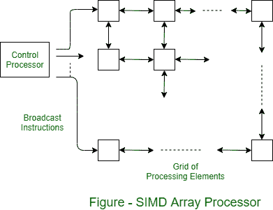

# SIMD 阵列处理器的运行

> 原文:[https://www . geesforgeks . org/operation-of-SIMD-array-processor/](https://www.geeksforgeeks.org/operation-of-simd-array-processor/)

并行处理的 SIMD 过程称为**阵列处理**。图中显示了阵列处理器。处理元件的二维网格传输来自中央控制处理器的指令流。当每条指令被传输时，所有元素同时执行它。出于数据交换的目的，每个处理元件都与其四个最近的邻居相连。可以在行和列上提供末端周围的连接，但是它们没有在图中示出。

考虑一个具体的计算来理解 [SIMD 架构](https://www.geeksforgeeks.org/computer-architecture-flynns-taxonomy/)的能力是有启发性的。处理元素的网格可以用来解决二维问题。例如，如果网格的每个元素代表空间中的一个点，则该阵列可用于计算导电平面内部各点的温度。

假设飞机的边缘保持在一定的温度下。由处理元素表示的离散点的近似解如下。外边缘在指定温度下初始化。所有内部点都是一些任意值的初始值，不一定相等。然后在每个元素中并行执行迭代。每一次迭代都包括通过平均四个最近邻居的当前值来计算一个点的更好的温度估计值。当序数估计值比某个预定的小差值更接近时，过程停止。

阵列处理器执行此类计算所需的容量非常简单。每个元素必须能够在图中所示的路径上与它的每个邻居交换值。每个处理元件都有一些寄存器和一些本地存储器来存储数据。它还有一个名为网络寄存器的寄存器，用于促进来自其邻居的值的移动。中央处理器可以广播指令，在网络中移动值，记录向上、向下、向左或向右的步长。

每个处理元件也有一个算术逻辑单元来执行控制处理器发送的算术指令。使用这些特性，可以重复传输一系列指令来实现迭代循环。控制处理器必须能够确定处理过程中的每个元素都已将其自身的温度分量发展到所需的精度。为此，每个元素将内部状态位设置为 1，以指示这种情况。网格互连包括允许控制器在迭代结束时检测所有状态位已经被设置的特征。

阵列处理器是高度专业化的机器。它们非常适合用矩阵或向量形式表示的数值问题。它们在加速一般计算中并不十分有用。