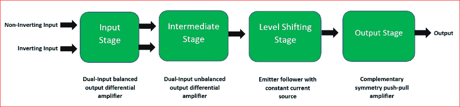
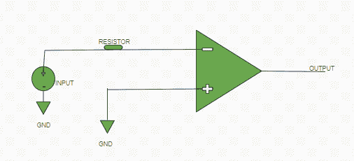
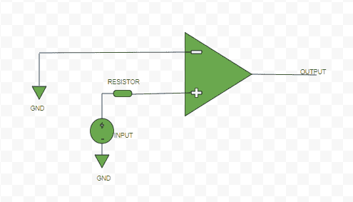
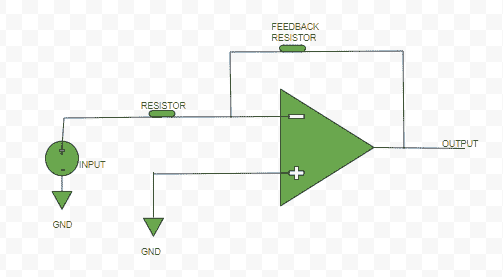
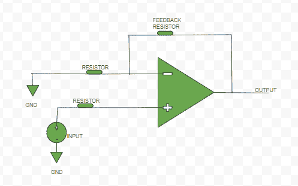

# 数字电子中的运算放大器

> 原文:[https://www . geesforgeks . org/运算放大器-数字电子运算放大器/](https://www.geeksforgeeks.org/operational-amplifier-op-amp-in-digital-electronics/)

放大器是一种增加输入信号强度的设备。它可以是电压放大器，其输入是某个电压，输出也是电压但被放大。电流放大器，其输入是一些电流，输出也是电流但被放大。



**运算放大器的框图**

*   **跨导放大器**，其输入是某个电压，输出是电流。
*   **跨阻放大器**，其输入是一些电流，输出是电压。

运算放大器(或称运放)是一种电压放大三端电子器件，有两个输入端，即反相端(在图中用“-”号标出)和非反相端(在图中用“+”号标出)，第三端是输出端。运算放大器的增益(“A”)=输出信号/输入信号

运算放大器的不同配置:

**开环配置–**
在该配置中，运算放大器没有任何反馈。理想情况下，它具有无限的开环增益(实际上比其输入端之间的电位差大几十万倍)。

#反转模式:



**反相开环运算放大器**

#同相模式:



**同相开环运算放大器**

**闭环配置–**
在运算放大器的这种配置中，使用负反馈，即输出电压的一部分施加回**反相输入端**。与开环增益相比，这种反馈大大降低了运算放大器的增益。因此，这是一种可控的放大方式。

#反转模式:



**反相闭环运算放大器**

#同相模式:



**同相闭环运算放大器**

**理想运算放大器的特性–**

*   **开环增益:**理想情况下，运算放大器应具有无限的开环增益(实际上它比其输入端之间的电位差大几十万倍)。
*   **输入阻抗或电阻:**理想情况下，运算放大器应具有无穷大的输入电阻(实际上应非常高)。
*   **输出阻抗或电阻:**理想情况下，运算放大器的输出电阻应该为零(实际上应该非常低)。
*   **带宽:**理想情况下，运算放大器的带宽应该是无限的(实际上是有限的)。
*   **CMRR:** 理想情况下，运算放大器应具有无限的 CMRR 共模抑制比，以便输出中的公共噪声电压变为零。
*   **压摆率:**理想情况下，运算放大器应具有无限的 SR，压摆率，以便输入电压的任何变化都会同时改变输出电压。

**运算放大器的基本术语–**

**1。压摆率:**运算放大器的压摆率(SR)定义为单位时间内输出电压的最大变化率。它以每微秒伏特数表示( *V* / *μs* )。

```
SR = (dVo / dt) |max
```

**2。输出失调电压:**当输入之间的电压差为零时，运算放大器的输出理想情况下应该为零，但实际上输出是非零的，有一个幅度非常小的电压。当没有输入时，输出端的这种不需要的电压称为输出失调电压。

**3。输入偏移电流:**当运算放大器没有输入电压时，进入反相和同相端的电流之差的大小。

```
Io = |Ib1-Ib2|; 
Io-Input Offset Current, Ib1 & 
Ib2-current at input terminals 
```

**4。输入偏置电流:**

```
 I(bias) = (Ib1+Ib2)/2 
```

**5。输入失调电压:**是为了消除输出失调电压的影响而特意施加在运算放大器反相或同相端的电压。

```
 V(Input Offset Voltage) = 0 (ideally)
V(Input Offset Voltage) = -V(Output Offset Voltage) (practically) 
```

**6。共模抑制比(CMRR):** 是差模增益(当不同信号施加到两个输入端时)与共模增益(当信号仅施加到一个输入端时)之间的比值。

```
CMRR = |(differential mode gain) / (common mode gain)| 
```

**7。电源电压抑制比(SVRR):** 定义为运算放大器的输入失调电压变化、 ***V <sub>io</sub>*** 与电源电压变化、 ***V*** 的比值。

```
SVRR = ΔV<sub>io /</sub> ΔV
```

**应用–**可用作:

*   反相和非反相加法器，
*   减法器，
*   积分器，
*   微分器，
*   对数放大器等。