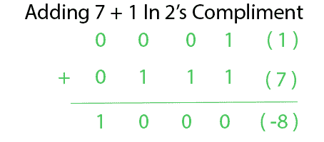
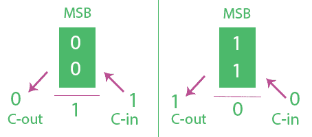
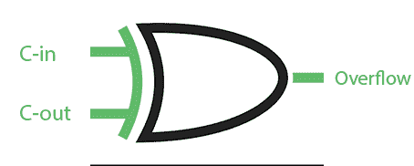

# 二进制数系统算术加法溢出

> 原文:[https://www . geeksforgeeks . org/二进制数加运算溢出系统/](https://www.geeksforgeeks.org/overflow-in-arithmetic-addition-in-binary-number-system/)

在计算机体系结构中，二进制补数系统被广泛使用。这里关于溢出的讨论主要将针对 2 的免费系统。

n 位 2 的补数系统可以表示从到
的数字，4 位可以表示从 **( -8 到 7 )**
的数字，5 位可以表示 2 的补数系统中从 **( -16 到 15 )** 的数字。

当两个 N 位二进制补码相加，并且答案太大而无法放入该 N 位组时，就会发生溢出。

计算机有 N 位固定寄存器。两个 N 位数字相加将产生最大 N+1 位数字。该额外位存储在进位标志中。但是进位并不总是表示溢出。

4 位加 7 + 1 必须等于 8。但是 8 不能用 4 位 2 的补数表示，因为它超出了范围。两个正数相加，我们得到的答案是负数(-8)。这里进位也是 0。通常由程序员来检测溢出并处理这种情况。

**溢出检测–**
溢出发生在:

1.  两个负数相加，得到一个肯定或否定的答案
2.  两个正数相加，答案是否定的。

因此溢出可以通过检查两个操作数的最高有效位来检测并回答。但是，除了使用 3 位比较器，也可以使用 2 位比较器检测溢出，只需从 MSB 中检查进位输入(C-in)和进位输出(C-out)。考虑 2 的补码数的 N 位加法。

流入流出时发生溢出。上面的溢出表达式可以从下面的分析中得到解释。

在第一个图中，两个数字的 MSB 是 0，这意味着它们是正的。这里如果 **C-in 为 1** 我们得到答案的 MSB 为 1 意味着答案为负(溢出)，而 **C-out 为 0。** C-in  C-out 遂溢出。

在第二个图中，两个数字的 MSB 是 1，这意味着它们是负数。这里如果 **C-in 为 0** 我们得到答案 MSB 为 0 表示答案为正(溢出)而 **C-out 为 1。** C-in  C-out 遂溢出。
读者也可以尝试 c 进 c 出和 MSB 的其他组合来检查溢出。

因此，MSB 的进位输入和进位输出足以检测溢出。

上面的异或门可以用来检测溢出。