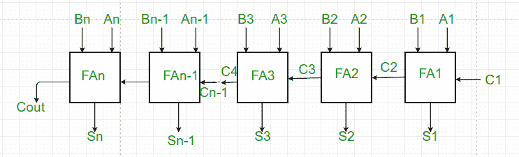

# 并行加法器和并行减法器

> 原文:[https://www . geeksforgeeks . org/并行加减器/](https://www.geeksforgeeks.org/parallel-adder-and-parallel-subtractor/)

先决条件–[全加器](https://www.geeksforgeeks.org/full-adder-digital-electronics/)、[全减法器](https://www.geeksforgeeks.org/digital-logic-full-subtractor/)

**并行加法器–**
单个全加器执行两个一位数的加法和一个输入进位。但是**并行加法器**是一种数字电路，能够通过对相应的位对进行并行运算，找到长度大于一位**的两个二进制数的算术**和**。它由连接成链的**全加器组成**，其中每个全加器的输出进位连接到链中下一个更高阶全加器的进位输入。**一个 n 位并行加法器需要 n 个全加器来执行运算。**所以对于两位数，需要两个加法器，而对于四位数，需要四个加法器，以此类推。并行加法器通常包含超前进位逻辑，以确保后续加法级之间的进位传播不会限制加法速度。**

**并行加法器的工作–**

1.  如图所示，首先，全加器 FA1 将 A1 和 B1 与进位 C1 相加，以生成和 S1(输出和的第一位)和进位 C2，进位连接到链中的下一个加法器。
2.  接下来，全加器 FA2 使用该进位位 C2 与输入位 A2 和 B2 相加，以生成和 S2(输出和的第二位)和进位 C3，该进位再次进一步连接到链中的下一个加法器，以此类推。
3.  该过程一直持续到最后一个全加器 FAn 使用进位位 Cn 与其输入 An 和 Bn 相加，生成输出的最后一位以及最后一个进位位 Cout。

**并行减法器–**

并行减法器是一种数字电路，通过对相应的位对进行并行运算，能够找出长度大于一位的两个二进制数的算术差。并行减法器可以用几种方式设计，包括半减法器和全减法器的组合、全减法器或具有减数补码输入的全加法器。

**并行减法器的工作–**

1.  如图所示，并行二进制减法器由所有全加器和减数补码输入组合而成。
2.  这个运算认为被减数和减数的 2 的补数的加法等于它们的减法。
3.  首先通过“非”门得到 B 的 1 的补码，通过进位加 1 得到 B 的 2 的补码，再加到 A 上进行算术减法。
4.  该过程一直持续到最后一个全加器 FAn 使用进位位 Cn 与其输入 An 和 Bn 的二进制补码相加，生成输出的最后一位以及最后一个进位位 Cout。

**并行加法器/减法器的优势–**

1.  与串行加法器/减法器相比，并行加法器/减法器执行加法操作更快。
2.  加法所需的时间不取决于位数。
3.  输出为并行形式，即所有位同时相加/相减。
4.  成本更低。

**并行加法器/减法器的缺点–**

1.  每个加法器必须等待链中前一个加法器产生的进位。
2.  传播延迟(与进位传输相关的延迟)随着要添加的位数的增加而增加。

**参考–**[加法器–维基百科](https://en.wikipedia.org/wiki/Adder_(electronics))