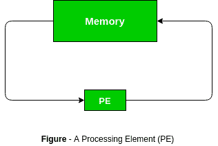

# 并行处理–脉动阵列

> 原文:[https://www . geeksforgeeks . org/并行处理-脉动-数组/](https://www.geeksforgeeks.org/parallel-processing-systolic-arrays/)

并行处理方法不同于传统的冯·诺依曼架构。一种这样的方法是使用脉动阵列的脉动处理的概念。

一个**脉动阵列**是一个处理器网络，有节奏地计算并通过系统传递数据。他们的名字来源于对血液如何有节奏地流过生物心脏的类比，因为数据从记忆中以有节奏的方式流过许多元素，然后再回到记忆中。这也是流水线和并行计算的一个例子。它于 20 世纪 70 年代推出，并于 1990 年被英特尔用于制造 CMU 的 iWarp 处理器。

在脉动阵列中，有大量相同的简单处理器或处理元件，它们排列成组织良好的结构，如线性或二维阵列。每个处理单元都与其他处理单元相连，并有一个有限的专用存储器。

主机站通常用于与网络中的外部世界进行通信。

**特征:**

1.  **并行计算–**
    许多过程同时进行。由于阵列具有非集中式结构，因此实现了并行计算。
2.  **管道性–**
    表示阵列可以实现高速。它显示了线性速率管道能力。
3.  **同步评估–**
    数据的计算由全局时钟计时，然后数据通过网络传递。全局时钟同步阵列，并具有固定长度的时钟周期。
4.  **重复性–**
    大部分阵列在整个网络中具有单一类型 pe 的重复性和互连性。
5.  **空间位置–**
    这些小区具有本地通信互连。
6.  **时间局部性–**
    信号从一个小区传输到另一个小区至少需要一个单位时间延迟。
7.  **模块化和规则性–**
    脉动阵列由模块化的处理单元组成，具有同质互连，计算机网络可以无限扩展。

**脉动阵列的优势–**

*   它采用高度的并行性，可以维持非常高的吞吐量。
*   它们非常紧凑、坚固且高效。
*   数据和控制流程简单而规则。

**脉动阵列的缺点–**

*   他们高度专业化，因此在他们能解决的问题上缺乏灵活性。
*   这些很难建造。
*   这些很贵。