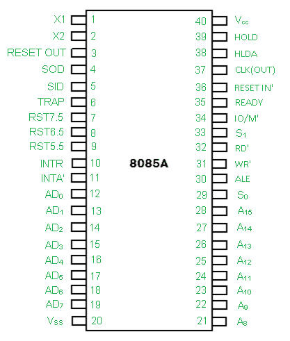

# 8085 微处理器引脚图

> 原文:[https://www . geesforgeks . org/pin-diagram-8085-微处理器/](https://www.geeksforgeeks.org/pin-diagram-8085-microprocessor/)

8085 微处理器的引脚图如下:

**1。地址总线和数据总线:**
地址总线是一组十六条线，即 A0-A15。地址总线是单向的，即位从微处理器单元向外围设备单向流动，并使用高阶地址总线。

**2。控制和状态信号:**

*   **ALE –** It is an Address Latch Enable signal. It goes high during first T state of a machine cycle and enables the lower 8-bits of the address, if its value is 1 otherwise data bus is activated. 
*   **IO/M’ –** It is a status signal which determines whether the address is for input-output or memory. When it is high(1) the address on the address bus is for input-output devices. When it is low(0) the address on the address bus is for the memory. 
*   **SO, S1 –** These are status signals. They distinguish the various types of operations such as halt, reading, instruction fetching or writing. 

<figure class="table">

| 输入/输出 | S1 | S0 | 数据总线状态 |
| --- | --- | --- | --- |
| Zero | one | one | 操作码提取 |
| Zero | one | Zero | 读存储器 |
| Zero | Zero | one | 存储写入 |
| one | one | Zero | 输入输出读取 |
| one | Zero | one | 输入输出写 |
| one | one | one | 中断确认 |
| Zero | Zero | Zero | 停止 |

</figure>

*   **RD’ –** It is a signal to control READ operation. When it is low the selected memory or input-output device is read. 
*   **WR’ –** It is a signal to control WRITE operation. When it goes low the data on the data bus is written into the selected memory or I/O location. 
*   **就绪–**它检测外设是否准备好传输数据。如果 READY 为高电平(1)，则外设已就绪。如果它是低电平(0)，微处理器等待直到它变高。这对于连接低速器件非常有用。

**3。电源和时钟频率:**

*   **Vcc –** +5v power supply 
*   **Vss –** Ground Reference 
*   **XI, X2 –** A crystal is connected at these two pins. The frequency is internally divided by two, therefore, to operate a system at 3MHZ the crystal should have frequency of 6MHZ. 
*   **CLK(OUT)–**这个信号可以作为其他设备的系统时钟。

**4。中断和外设启动信号:**
8085 有五个中断信号，可用于中断程序执行。

(I)介绍
(ii)rst 7.5
(iii)rst 6.5
(iv)rst 5.5
(v)陷阱

微处理器通过 INTA 的信号确认中断请求。除了中断，还有三个外部启动的信号，即复位、保持和就绪。为了响应保持请求，它有一个信号叫做 HLDA。

*   **INTR –** It is an interrupt request signal. 
*   **INTA’–**是微处理器收到 INTR 后发送的中断确认。

**5。复位信号:**

*   **RESET IN’ –** When the signal on this pin is low(0), the program-counter is set to zero, the buses are tristated and the microprocessor unit is reset. 
*   **复位输出–**该信号表示微处理器正在复位。该信号可用于复位其他设备。

**6。直接存储器存取信号:**

*   **HOLD –** It indicates that another device is requesting the use of the address and data bus. Having received HOLD request the microprocessor relinquishes the use of the buses as soon as the current machine cycle is completed. Internal processing may continue. After the removal of the HOLD signal the processor regains the bus. 
*   **HLDA–**这是一个信号，表示在删除保持请求后，保持请求已被接收，HLDA 变低。

**7。串行输入输出端口:**
8085 中的串行传输由两个信号实现，

*   **SID 和 SOD–**SID 是串行输入的数据线，其中 as SOD 是串行输出的数据线。