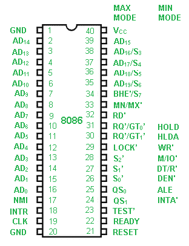

# 8086 微处理器引脚图

> 原文:[https://www . geesforgeks . org/pin-diagram-8086-微处理器/](https://www.geeksforgeeks.org/pin-diagram-8086-microprocessor/)

8086 微处理器的引脚图如下:

英特尔 8086 是一款 16 位 HMOS 微处理器。它提供 40 引脚 DIP 芯片。它使用 5V DC 电源工作。8086 采用 20 线地址总线。它有一条 16 线数据总线。地址总线的 20 条线路以多路复用模式运行。16 条低位地址总线已经与数据多路复用，4 条高位地址总线已经与状态信号多路复用。

**AD0-AD15 :** 地址/数据总线。这些是低位地址总线。它们与数据复用在一起。当使用广告线传输存储器地址时，使用符号 A 代替广告，例如 A0-A15。当数据通过广告线路传输时，使用符号 D 代替广告，例如 D0-D7、D8-D15 或 D0-D15。

**A16-A19 :** 高阶地址总线。这些信号与状态信号多路复用。

**S2、S1、S0 :** 状态引脚。这些引脚在 T4、T1 和 T2 状态期间处于活动状态，在 T3 或 Tw(就绪为非活动状态)期间返回到被动状态(1，1，1)。这些被 8288 总线控制器用来产生所有的存储器和输入/输出操作访问控制信号。T4 期间 S2、S1、S0 的任何变化都表明一个公共汽车周期的开始。

<figure class="table">

| S2 | S1 | S0 | 特征 |
| --- | --- | --- | --- |
| Zero | Zero | Zero | 中断确认 |
| Zero | Zero | one | 读取输入输出端口 |
| Zero | one | Zero | 写输入输出端口 |
| Zero | one | one | 停止 |
| one | Zero | Zero | 代码访问 |
| one | Zero | one | 读取内存 |
| one | one | Zero | 写存储器 |
| one | one | one | 钝态 |

**A16/S3、A17/S4、A18/S5、A19/S6 :** 指定的地址线与相应的状态信号多路复用。

<figure class="table">

| A17/S4 | A16/S3 | 功能 |
| --- | --- | --- |
| Zero | Zero | 额外段访问 |
| Zero | one | 堆栈段访问 |
| one | Zero | 代码段访问 |
| one | one | 数据段访问 |

**BHE/S7:**总线高电平使能/状态。T1 期间为低电平。它用于将数据传输到数据总线的最高有效位 D8-D15。连接到数据总线上半部分的 8 位设备使用 BHE(低电平有效)信号。它与状态信号 S7 多路复用。T2、T3 和 T4 期间提供 S7 信号。

**RD':** 这是用于读操作。这是一个输出信号。低电平时有效。

**就绪:**这是来自内存或慢速设备的确认，表示它们已经完成数据传输。8284A 时钟发生器同步器件提供的信号，为微处理器提供就绪输入。信号为高电平有效(1)。

**INTR :** 中断请求。这是触发输入。这是在每个指令的最后一个时钟周期内采样的，用于确定请求的可用性。如果发现任何中断请求未决，处理器将进入中断确认周期。这可以在产生中断使能标志后在内部屏蔽。该信号为高电平有效(1)，并已在内部同步。

**NMI :** 不可屏蔽中断。这是一个边沿触发输入，会导致第二类中断。然后，子程序通过位于系统存储器中的中断向量查找表进行向量化。NMI 在软件内部是不可屏蔽的。从低(0)到高(1)的转换在当前指令结束时启动中断。该输入已在内部同步。

**INTA :** 中断确认。在每个中断确认周期的 T2、T3 和 Tw 期间，它为低电平有效(0)。

**MN/MX:**最小值/最大值。该引脚信号指示处理器将以何种模式工作。

**RQ'/GT1 '，RQ '/GT0 ':**请求/授权。这些引脚由本地总线主控器使用，用于迫使微处理器在微处理器当前总线周期结束时释放本地总线。每个引脚都是双向的。RQ'/GT0 '的优先级高于 RQ'/GT1 '。

**锁定:**这是一个低电平有效引脚。它表示当“锁定”为低电平有效(0)时，不允许其他系统总线主控获得对系统总线的控制。锁定信号将一直有效，直到下一条指令完成。

**测试:**这由“等待”指令检查。如果测试引脚变为低电平(0)，执行将继续，否则处理器保持空闲状态。在时钟前沿的每个时钟周期内，输入在内部同步。

**CLK :** 时钟输入。时钟输入为处理操作和总线控制活动提供基本时序。它是非对称方波，占空比为 33%。

**复位:**该引脚要求微处理器立即终止其当前活动。该信号必须在至少四个时钟周期内为高电平有效(1)。

**Vcc :** 电源(+5V 直流)

**GND :** 地面

**QS1、QS0 :** 队列状态。根据下表，这些信号指示内部 8086 指令队列的状态

<figure class="table">

| QS1 | QS0 | 状态 |
| --- | --- | --- |
| Zero | Zero | 无操作 |
| Zero | one | 队列中 op 代码的第一个字节 |
| one | Zero | 清空队列 |
| one | one | 队列中的后续字节 |

**DT/R :** 数据发送/接收。想要使用 8286 或 8287 数据总线收发器的最小系统需要此引脚。数据流的方向通过收发器控制。

**DEN :** 数据使能。在使用收发器的最小系统中，该引脚作为 8286/8287 的输出使能。在每次存储器和输入输出访问以及 INTA 周期中，DEN 为低电平有效(0)。

**保持/保持:**保持表示另一个主机已经请求本地总线。这是有效高电平(1)。接收保持请求的微处理器将在 T4 或 T1 时钟周期的中间发出 HLDA(高电平)作为确认。

**ALE :** 地址锁存使能。ALE 由微处理器提供，用于将地址锁存到 8282 或 8283 地址锁存器中。在任何总线周期的 T1 期间，它都是一个有效的高(1)脉冲。ALE 信号从不浮动，始终是整数。

</figure>

</figure>

</figure>