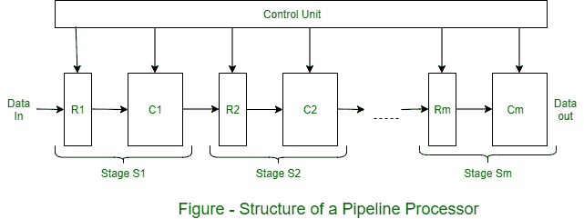

# 流水线架构及其示意图

> 原文:[https://www . geesforgeks . org/pipelined-architecture-with-its-diagram/](https://www.geeksforgeeks.org/pipelined-architecture-with-its-diagram/)

**流水线处理器**由 m 个数据处理电路的序列组成，称为级或段，它们共同对通过它们的数据操作数流执行单个操作。每个阶段都会进行一些处理，但只有在操作数集通过整个流水线之后，才能获得最终结果。如图所示，级 S (i) 包含一个多字输入寄存器或锁存器 R (i) ，和一个数据路径电路 C (i) ，通常是组合的。R (i) 在管道中移动时保存部分处理的结果；它们还充当缓冲器，防止相邻级相互干扰。

一个公共时钟信号使 R (i) 同步改变状态。每个 R (i) 同步改变状态。每个 R (i) 从前一级 S (i-1) 接收一组新的输入数据 D (i-1) ，但 R (1) 除外，其数据由外部源提供。D (i-1) 代表 C (i-1) 在前一个时钟周期计算的结果。一旦 D (i-1) 已经被加载到 R (i) 中，C (i) 前进到 D (i-1) 以计算新的数据集 D (i) 。因此，在每个时钟周期，每个阶段都将其先前的结果转移到下一个阶段，并计算一组新的结果。

