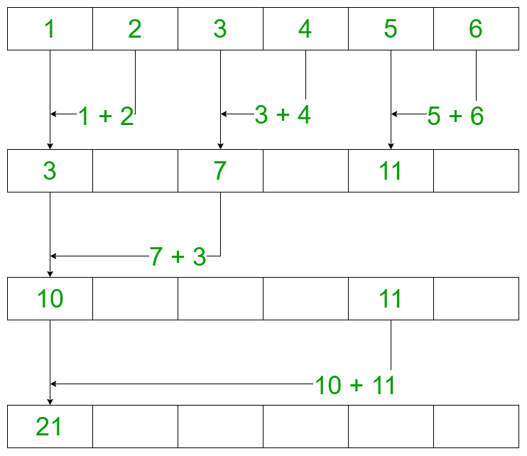

# PRAM 或并行随机存取机

> 原文:[https://www . geeksforgeeks . org/pram-or-parallel-random-access-machines/](https://www.geeksforgeeks.org/pram-or-parallel-random-access-machines/)

**并行随机存取机**，也叫 **PRAM** ，是大多数[并行算法](https://www.geeksforgeeks.org/introduction-to-parallel-computing/)考虑的模型。它有助于在没有任何架构约束的情况下编写前驱并行算法，并允许并行算法设计者将处理能力视为无限的。它忽略了[进程间通信](https://www.geeksforgeeks.org/inter-process-communication-ipc/)的复杂性。PRAM 算法大部分是理论性的，但可以作为为实际机器开发高效并行算法的基础，也可以激励构建专门的机器。

**PRAM 架构模型:**以下是 PRAM 包含的模块:

1.  它由一个控制单元、全局内存和一组无限的相似处理器组成，每个处理器都有自己的私有内存。
2.  活动处理器从全局内存中读取，执行所需的计算，然后写入全局内存。
3.  因此，如果一个 PRAM 中有 N 个处理器，那么在特定的时间单位内可以执行 N 个独立的操作。

**PRAM 的模型:**在访问共享内存时，在执行读写操作时可能会有冲突(即，一个处理器可以访问另一个处理器已经在访问的内存块)。因此，在处理读或写冲突的 PRAM 模型上有各种各样的约束。它们是:

*   **EREW:** 也称为独占读独占写是一个约束，不允许两个处理器在同一个实例上从同一个内存位置读写。
*   **CREW:** 也称为并发读独占写是一种约束，它允许所有处理器从同一个内存位置读取，但不允许同时写入同一个内存位置。
*   **ERCW:** 也称为独占读并发写是一种约束，它允许所有处理器写入同一存储位置，但现在允许同时读取同一存储位置。
*   **CRCW:** 也称为并发读并发写是一种约束，它允许所有处理器并行读写同一个内存位置。

**示例:**假设我们希望添加一个由 N 个数字组成的数组。我们一般迭代数组，用 N 步求数组的和。所以，如果数组的大小是 N，对于每一步，我们假设花费的时间是 1 秒。因此，完成迭代需要 N 秒。使用 PRAM 的 CRCW 模型可以更有效地执行相同的操作。假设一个大小为 N 的数组有 N/2 个并行处理器，那么执行所花费的时间为 4，在下图中少于 N = 6 秒。
