# 最小化循环布尔函数的素数隐含图

> 原文:[https://www . geesforgeks . org/prime-implican-chart-for-minimum-cycle-boolean-functions/](https://www.geeksforgeeks.org/prime-implicant-chart-for-minimizing-cyclic-boolean-functions/)

先决条件–[K-Map(卡诺图)](https://www.geeksforgeeks.org/k-mapkarnaugh-map/)、[K-Map 中的隐含项](https://www.geeksforgeeks.org/digital-logic-implicants-k-map/)、
如果一个函数在其各自的 K-Map 中没有*本质*素隐含项，则称该函数为**循环布尔函数**。

**循环函数的性质:**

*   每一个质数隐式都是相同的大小。
*   每个最小项至少被两个素隐含项覆盖(这意味着没有本质的素隐含项)。
*   没有本质的质因数意味着对于这些函数存在不止一个最小化的解/表达式，这将进一步使用数字电路来实现。
*   对于一个循环函数，我们可以有两个没有素蕴涵重叠的极小形式。

**例:**
求以下函数的最小表达式。

```
f(w, x, y, z) = (0, 2, 4, 5, 10, 11, 13, 15) 
```

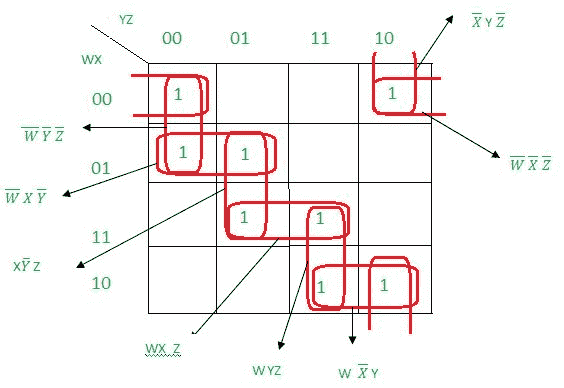

正如我们在上面的 K-Map 中看到的，不存在本质的素蕴涵。这里我们可以用质数隐含图来轻松求解。

**使用素数隐含图求解上述函数的步骤:**

*   **Step-1:** 
    Draw prime Implicant chart as below.The horizontal entries denote the given minterms which are mapped against all prime Implicants (vertically).The square boxes are crossed (‘x’) whenever a prime Implicant covers a particular minterm in K-Map. 

    例如，“WXZ”质数隐含覆盖 13 和 15，因此相应的正方形被交叉(用“x”表示)。

    **注意**即 A、B、C、D..，是用来表示所有质数隐含的变量。

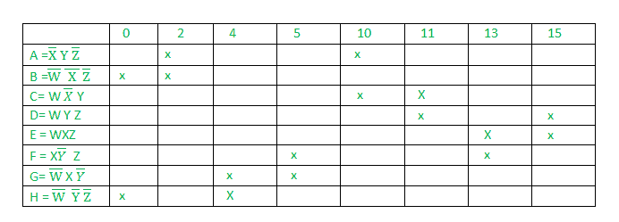

*   **Step-2:** 
    Arbitrarily choose any prime Implicant; check () the prime Implicant and the corresponding covered minterms as well. Now delete the row of the prime Implicant and corresponding columns of its minterms. 

    在我们的例子中，选择了覆盖最小项 2 和 10 的素数隐式 A。因此。删除 A 行以及 2 和 10 列。任意选择的素数隐含(在我们的例子 A 中)必须出现在最终的极小表达式中。

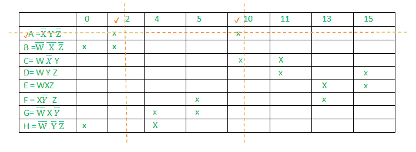

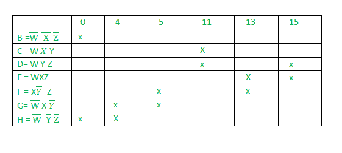

*   **Step-3:** 
    Find all such prime Implicant which are being covered by other prime Implicant completely and remove their corresponding rows (since these are non essential prime Implicants.). 

    在我们的例子中，H 覆盖了{0，4}，B 覆盖了{0}，这意味着 H 覆盖了 B 覆盖的所有子元素，所以删除 B。同样，D 完全覆盖了 C，所以删除 C。


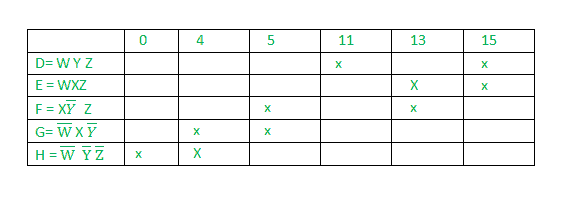

*   **第 4 步:**
    现在按照下面子步骤中提到的质数隐含图的标准程序进行:
    1.  Find the minterm which is covered by only one prime Implicant. 
    2.  Check () that minterm, its corresponding prime Implicant and all other minterms which are covered by that corresponding prime Implicant. 
    3.  如果检查了所有的最小项()，停止程序，否则转到子步骤-1。

**例-2** :求以下循环函数的最小表达式。

```
f(x, y, z) = (0, 1, 2, 5, 6, 7) 
```

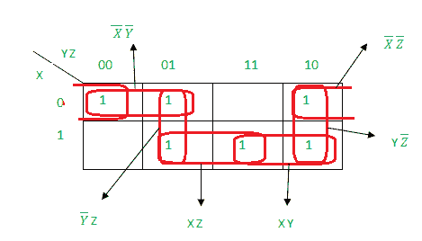

**第一步:**
绘制质数隐含图。

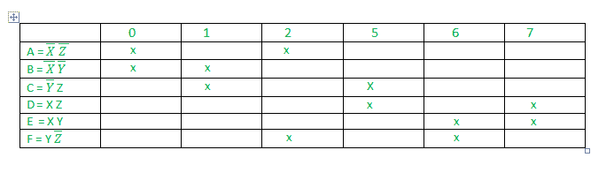

**第二步:**
A 任意选择。现在删除了 A 行和相应的 minterms (0 和 2)的列。

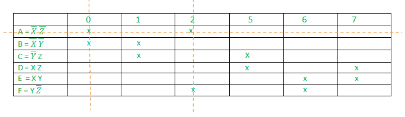

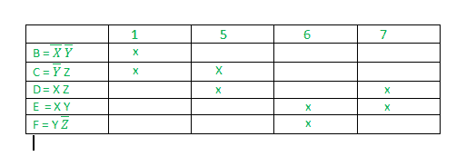

**第三步:**
由于 B 和 F 分别被 C 和 E 完全覆盖，因此删除了素隐含 B 和 F。

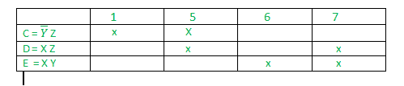

**步骤-4:**
现在按照例-1 中提到的质数隐含图的标准程序。

最小项 1 被素数隐含 C 覆盖，因此只检查( ) C 及其覆盖的所有最小项(1 和 5)。

最小项 6 被素数隐含 E 覆盖，因此只检查( ) E 以及它所覆盖的所有最小项(6 和 7)。

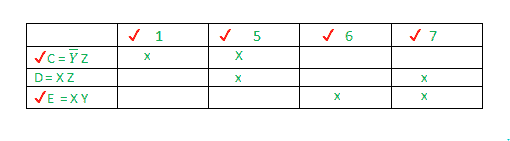

现在，由于所有的最小项(1，5，6，7)都被检查过了()，因此停止程序。

```
Final Minimal Expression: A + C + E  
```