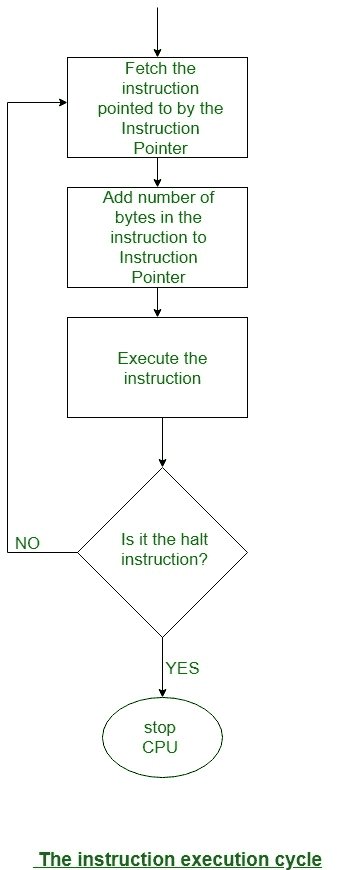

# 中央处理器中的程序执行

> 原文:[https://www.geeksforgeeks.org/program-execution-in-the-cpu/](https://www.geeksforgeeks.org/program-execution-in-the-cpu/)

无论中央处理器是如何编程的，你都可能是投机的。它包含一个特殊的寄存器——指令寄存器——它的位模式决定了中央处理器能做什么。一旦该动作已经完成，指令寄存器内的位模式可以被修改，并且中央处理器单元也可以执行由该下一位模式指定的操作。

因为方向只是位模式，所以它们将被保存在内存中。指令指针寄存器持续具有(指向)要执行的下一条指令的存储器地址。至于管理单元执行这个指令，它被导出到指令寄存器中。情况如下:

1.  指令序列存储在存储器中。
2.  找到第一条指令的存储器地址被复制到指令指针。
3.  中央处理器将指令指针内的地址发送到地址总线上的存储器。
4.  中央处理器向控制总线发送“读取”信号。
5.  存储器通过在
    数据总线上发送该存储位置的位状态副本来响应，然后中央处理器将其复制到其指令寄存器中。
6.  指令指针自动递增，以包含存储器中下一条
    指令的地址。
7.  中央处理器执行指令寄存器中的指令。
8.  转到步骤 3

步骤 3、4 和 5 称为取指令。请注意，步骤 3–8 构成了一个周期，即指令执行周期。如下图所示。
